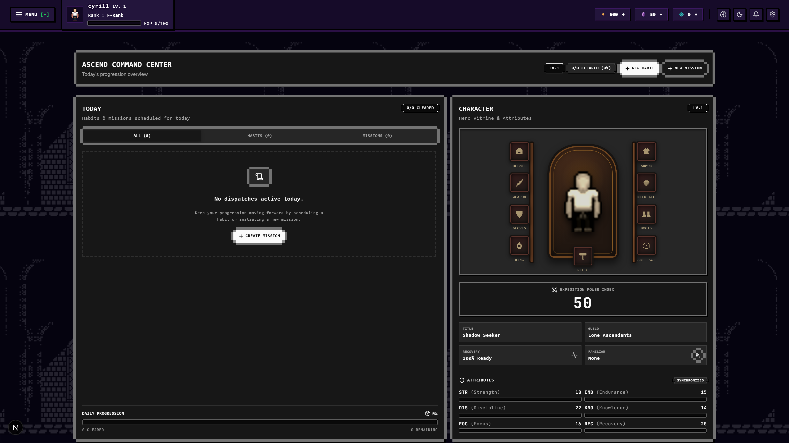
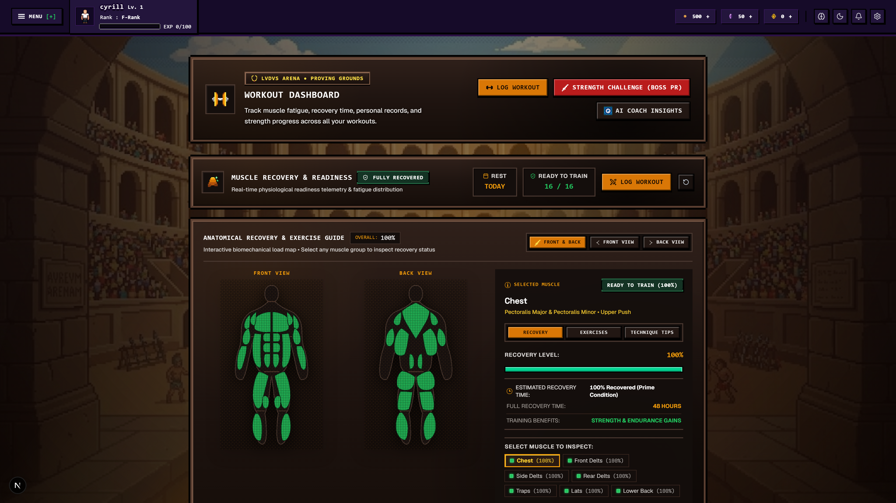
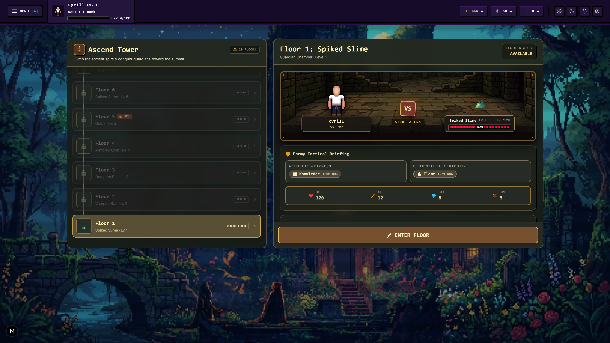
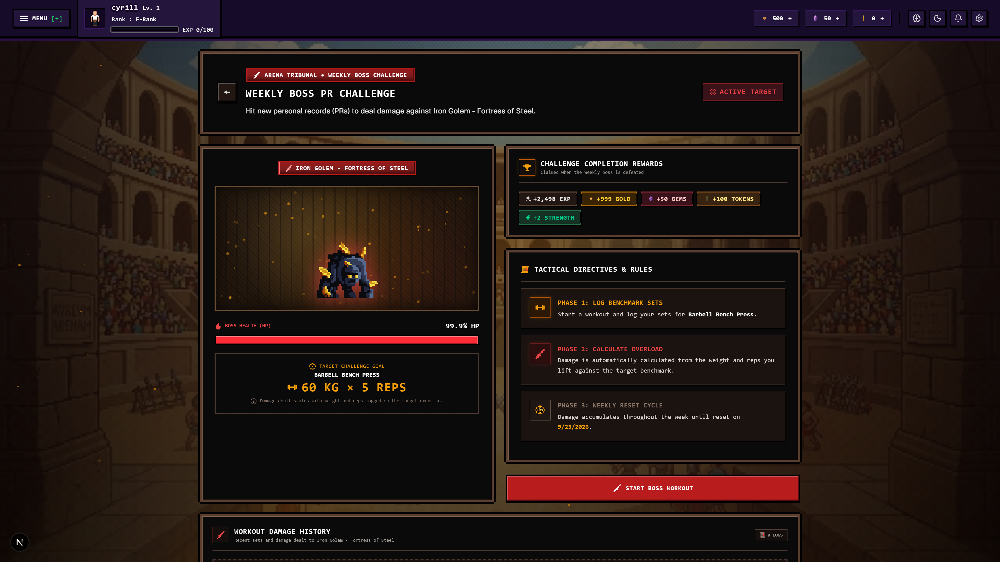
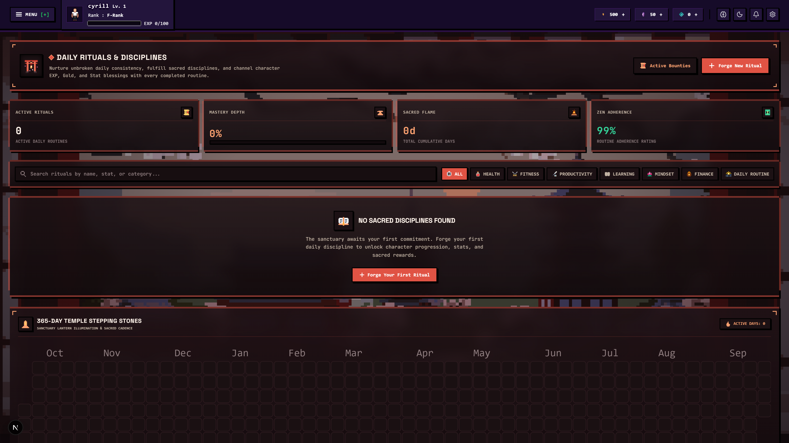
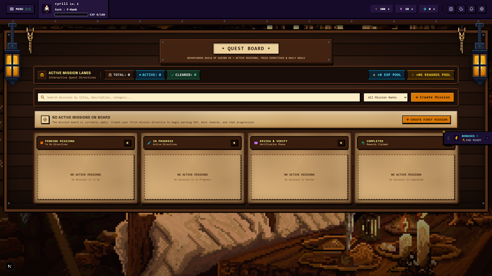
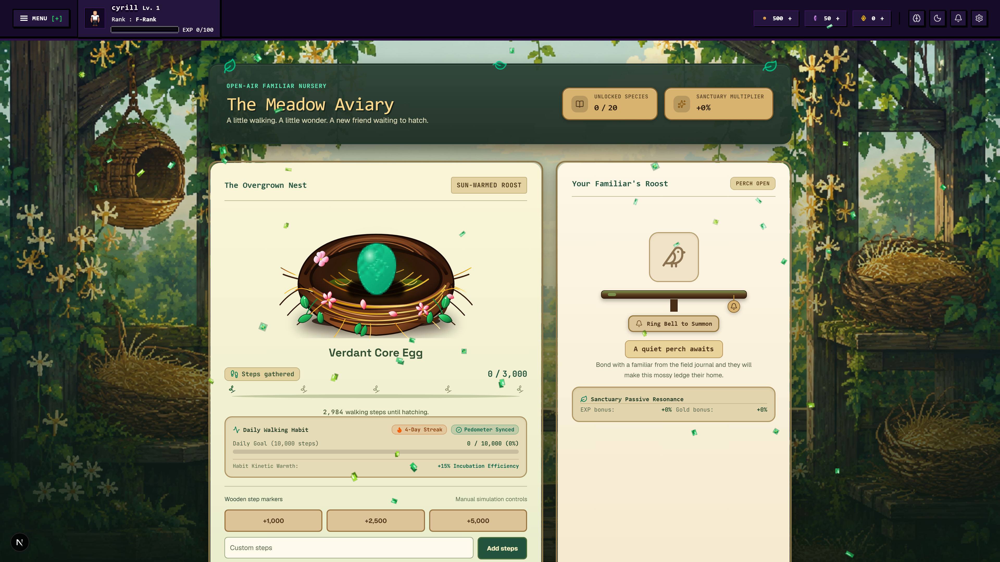
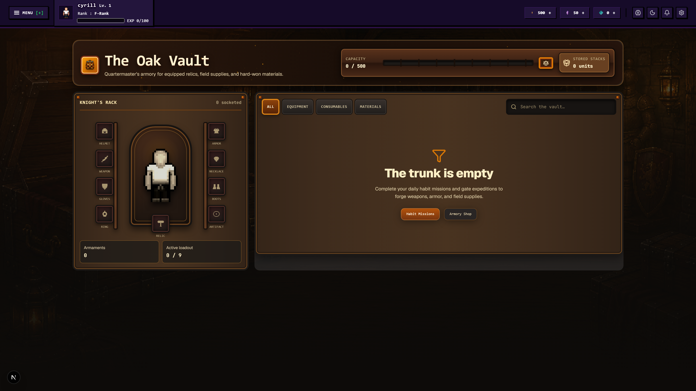
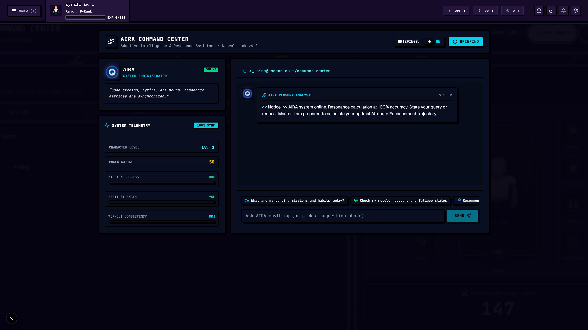

<div align="center">

# 🌌 ASCEND CORE
### The Gamified Self-Mastery & Physical Evolution. Preview Pictures, Videos and Vercel Deployment is outdated, will update later. 

[](https://nextjs.org/)
[](https://react.dev/)
[](https://www.typescriptlang.org/)
[](https://tailwindcss.com/)
[](https://fastapi.tiangolo.com/)
[](https://python.org/)
[](https://prisma.io/)
[](https://sqlite.org/)
[](https://opensource.org/licenses/MIT)

<p align="center">
  <em>Transform real-world workouts, habit streaks, cognitive deep work, and discipline into a tactical progression RPG. Ascend OS bridges real-world effort (The Reality Layer) with a deep simulated game world (The RPG Layer) to eradicate burnout, overcome the 30-day retention cliff, and turn daily mastery into an epic solo ascension.</em>
</p>

[Visual Showcase](#-complete-video-walkthrough--module-showcase) • [Dashboard Overview](#-1-main-dashboard-command-center) • [Stat Matrix & Lore](#-2-stat-matrix-rpg-attributes-classes--titles) • [Subsystems](#-core-subsystems--feature-breakdown) • [Architecture](#-system-architecture) • [Quick Start](#-quick-start--local-development)

---

</div>

## 🎥 Complete Video Walkthrough & Module Showcase

Ascend OS includes 20 live captured module walkthroughs showcasing every interface, combat encounter, and AI-driven workflow in the system:

<div align="center">

| Module | Walkthrough Preview & Video Link | Key Mechanics & Highlights |
| :--- | :---: | :--- |
| **Main Dashboard** | [🎬 Watch `main-dashboard 1.webm`](client/public/screenshots/main-dashboard%201.webm) | Overview HUD, 7-stat radar, anatomical recovery silhouette, active quests & beast telemetry. |
| **AIRA Neural System** | [🎬 Watch `aira system.webm`](client/public/screenshots/aira%20system.webm) | Clinical AI advisor, predictive intelligence, automated workout/habit mutation, and combat analytics. |
| **Tower of Ascension** | [🎬 Watch `tower.webm`](client/public/screenshots/tower.webm) | 20-floor tactical dungeon crawl, turn-based auto-combat, and **AIRA defeat diagnosis**. |
| **Workout & Heatmap** | [🎬 Watch `workout.webm`](client/public/screenshots/workout.webm) | Active set logger, real-time rest timer, Brzycki 1RM engine, and 16-muscle time-decay heatmap. |
| **AIRA Workout Intel** | [🎬 Watch `workout-aira intel.webm`](client/public/screenshots/workout-aira%20intel.webm) | Clinical plateau evaluation, progressive overload recommendations (+2.5 kg), and session summaries. |
| **Boss PR Arena** | [🎬 Watch `boss-pr.webm`](client/public/screenshots/boss-pr.webm) | Transform heavy compound lift records (Squat/Bench/Deadlift/OHP) into titanic boss fights. |
| **Epic Goal Bosses** | [🎬 Watch `bosses.webm`](client/public/screenshots/bosses.webm) | Multi-month life goals turned into raid bosses damaged directly by daily habit executions. |
| **Habit Mastery** | [🎬 Watch `habits.webm`](client/public/screenshots/habits.webm) | 3-tier sizing (Mini/Normal/Elite), full-year activity heatmap, streak shields, & AIRA summaries. |
| **Missions & Quests** | [🎬 Watch `missions.webm`](client/public/screenshots/missions.webm) | Kanban quest board, multi-step subtask checklists, difficulty tiers, and scheduled deadlines. |
| **Beast Incubation** | [🎬 Watch `beast and pets.webm`](client/public/screenshots/beast%20and%20pets.webm) | Physical step syncing, 20-dragon animated bestiary, passive buffs, and ascension leveling. |
| **Inventory & PaperDoll** | [🎬 Watch `inventory.webm`](client/public/screenshots/inventory.webm) | 9-slot visual gear matrix, item inspection with deep lore, requirements, and consumable usage. |
| **Blacksmith Forge** | [🎬 Watch `forge and craft.webm`](client/public/screenshots/forge%20and%20craft.webm) | Recipe crafting, gear refinement (+1 to +10), salvaging materials, and equipment stats. |
| **Skill Constellations** | [🎬 Watch `skills.webm`](client/public/screenshots/skills.webm) | Branching class skill trees (Warrior, Mage, Assassin, Paladin, Shadow Monarch) spending SP. |
| **Learning & Focus** | [🎬 Watch `learning and focus.webm`](client/public/screenshots/learning%20and%20focus.webm) | Habit-linked Pomodoro deep work timer, study categories, and **Cyber Rain ambient music player**. |
| **Sleep & Rest** | [🎬 Watch `sleep and rest.webm`](client/public/screenshots/sleep%20and%20rest.webm) | Sleep duration & quality logger, recovery efficiency curve, and Recovery (REC) stat bonuses. |
| **Schedule Calendar** | [🎬 Watch `calendar.webm`](client/public/screenshots/calendar.webm) | Monthly/weekly timeline combining habit streaks, workouts, and quest deadlines into one HUD. |
| **Item Market & Shop** | [🎬 Watch `shop.webm`](client/public/screenshots/shop.webm) | Rotating daily stock, gold/gem sinks, mystery beast eggs, consumable potions, and scrolls. |
| **Achievements** | [🎬 Watch `achievements.webm`](client/public/screenshots/achievements.webm) | Tiered milestone badges across Combat, Fitness, Discipline, and Exploration with gem rewards. |
| **Hunter Profile** | [🎬 Watch `profile.webm`](client/public/screenshots/profile.webm) | Hunter credentials, stat allocation matrix, milestone titles with multipliers, & historical log. |
| **Landing Portal** | [🎬 Watch `landing.webm`](client/public/screenshots/landing.webm) | Public gateway, feature breakdown, lore introduction, and secure onboarding flow. |

<br>

### 📸 High-Resolution HUD & Module Showcase

<div align="center">

| 🖥️ Main Dashboard Overview | 🩻 16-Muscle Recovery Heatmap & Workout |
| :---: | :---: |
|  |  |
| *7-Stat radar, rank telemetry, active quests & beast companion* | *16-muscle anatomical time-decay silhouette & 1RM gym logger* |

| ⚔️ Tower of Ascension Gauntlet | 🏆 Boss PR Breakthrough Arena |
| :---: | :---: |
|  |  |
| *20-Floor auto-combat simulator & AIRA defeat analysis* | *Transform compound lift PRs into titanic boss battles* |

| 🔁 Habit Mastery & Continuous Math | 🎯 Kanban Quests & Multi-Step Checklists |
| :---: | :---: |
|  |  |
| *3-Tier sizing, 365-day heatmap & streak freeze shields* | *Organized task workflow with dynamic progress tracking* |

| 🐉 Beast Incubation & 20 Dragons | 🧙 9-Slot PaperDoll Equipment & Lore |
| :---: | :---: |
|  |  |
| *Real-world step incubation & 20 animated elemental dragons* | *9-Slot equipment grid, item inspect tooltips, & item lore* |

| ⚡ Daily System Surges & Boosts | 👑 Weekly Epic Directives Hub |
| :---: | :---: |
|  |  |
| *Auto-applying 2x Habit, Learning & Workout Surges + Free Egg Claim* | *Weekly PR Boss confrontation, 40k step quotas, & Tower trials* |

| 🤖 AIRA Neural System & Timely Briefings |
| :---: |
|  |
| *Conversational AI administrator, tool calling, and live contextual system briefings* |

</div>

---

## 🌟 Core Philosophy: The Reality vs. RPG Divide

Standard fitness and habit tracking apps suffer from an industry-wide **Day-30 retention cliff** (sub-4% retention) driven by **loss aversion**, **binary streak resets**, and the **"What-the-Hell" psychological effect**. A single missed day often resets a streak to zero, destroying intrinsic motivation.

**Ascend OS completely solves this through architectural separation:**
1. **The Reality Layer (Real Life):** Real-world habits, heavy compound gym sessions, deep work blocks, and sleep hygiene are purely the **training grounds** that generate attributes.
2. **The RPG Layer (The Tower & Gauntlets):** The simulated game where your earned stats are put to the test. You never defeat a monster by simply checking a box; you conquer dungeons using the tangible power earned from your real-world discipline.
3. **Algorithmic Mathematical Forgiveness:** Replaces fragile binary streak counters with an **asymptotic continuous habit strength curve** ($S_t \in [0.0, 1.0]$) and automated **Streak Freeze Shields**, preventing total momentum loss on missed days.

---

## 🖥️ 1. Main Dashboard (Command Center)

The Main Dashboard is the primary nerve center of Ascend OS, unifying all life and character telemetry into a high-density cyberpunk HUD:

- **Hunter Identity & Status Bar:** Displays Level, Class Archetype, Hunter Rank (E-Rank up to SSS-Rank National Level), Power Score, current HP, and EXP progress bar towards the next level.
- **Dual Currency Indicators:** Real-time counter for **Gold** (soft currency) and **Gems** (hard currency), alongside current Season Pass progression.
- **7-Attribute Radar Visualization:** Recharts-powered interactive radar displaying your real-time balance across Strength, Knowledge, Discipline, Focus, Endurance, Recovery, and Consistency.
- **16-Muscle Anatomical Silhouette Heatmap:** Interactive front/back vector anatomical model color-coded by real-time time-decay fatigue. Shows which muscle groups are primed for training and which are in deep recovery.
- **Active Quests & Habit Fast-Actions:** Quick checklist of pending daily missions and habits allowing instant logging without navigating away from the overview.
- **Active Companion Beast Widget:** Displays your equipped companion dragon, current incubation progress on mystery eggs, and active step counts.
- **AIRA Neural Briefing Feed:** Context-aware status updates and daily reminders delivered directly by the AIRA AI engine.

---

## 📊 2. Stat Matrix, RPG Attributes, Classes & Titles

### Interactive Stat Matrix
- **Base Stats vs. Combat Stats:** View natural attributes earned through real-world execution alongside equipment and companion passive multipliers.
- **Hover Lore Tooltips & Improvement Roadmaps:** Hovering over any attribute in the Matrix opens a rich diagnostic card detailing its mechanical RPG function, combat formulas, and exact real-world action pathways to improve it:
  - 🔴 **Strength (STR):** Scale tower physical damage & boss breakthrough power $\rightarrow$ *Improve via heavy compound gym lifts (Squats, Bench, Deadlifts).*
  - 🔵 **Knowledge (KNW):** Amplify spell damage & cognitive bandwidth $\rightarrow$ *Improve via deep work study blocks, reading habits, and courses.*
  - 🟢 **Recovery (REC):** Turn-based HP regeneration in combat & faster muscle recovery $\rightarrow$ *Improve via 7-9h high-quality sleep, rest days, and stretching.*
  - 🛡️ **Discipline (DIS):** Damage mitigation & habit streak preservation $\rightarrow$ *Improve via unbroken daily routine consistency and cold showers.*
  - 💛 **Endurance (END):** Expands maximum Player HP pool $\rightarrow$ *Improve via cardio, running sessions, and hitting 8,000+ daily steps.*
  - 🟣 **Focus (FCS):** Critical hit chance (up to 75%) & armor penetration $\rightarrow$ *Improve via Pomodoro deep work blocks without tab switching.*
  - ⚪ **Consistency (CON):** Rare loot drop rates, crafting yields, and gold multiplier $\rightarrow$ *Improve via completing all scheduled habits across 7+ day windows.*

### Classes & Specializations
- Unlock specialized Hunter classes (e.g. *Iron Juggernaut*, *Archmage*, *Shadow Assassin*, *Holy Paladin*, *Monarch of Shadows*) upon meeting specific attribute thresholds.
- Classes bestow unique passive attribute modifiers and unlock branching Skill Trees.

### Equippable Milestone Titles
- Earn prestigious titles through monumental achievements (e.g., *"The Awakened"*, *"Void Conqueror"*, *"Relentless Disciplinarian"*, *"Titan of Iron"*).
- Equipping titles provides permanent account-wide percentage multipliers to EXP, Gold, and specific attribute groups.

### Logged Entries & Audit Trail
- Full historical audit log showing every single attribute gain with timestamps, source tags (`WORKOUT`, `HABIT`, `MISSION`, `FOCUS_SESSION`, `SLEEP`), and exact numerical gains.

---

## 🎯 3. Missions (Quests) & AIRA Timely Summaries

### Quest Mechanics
- **3-Tier Sizing:**
  - **Mini (Friction Baseline):** 10-15 minute task $\rightarrow$ $+15\text{ EXP}$, $+10\text{ Gold}$.
  - **Normal (Standard Quest):** 30-45 minute task $\rightarrow$ $+45\text{ EXP}$, $+25\text{ Gold}$.
  - **Elite (Major Objective):** 60+ minute major undertaking $\rightarrow$ $+120\text{ EXP}$, $+75\text{ Gold}$, $+0.5\text{ Stat Points}$.
- **Multi-Step Subtask Checklists:** Create rich missions with sub-checklists; checking off subtasks updates progress bars dynamically.
- **Kanban Quest Board:** Organize missions across *Pending*, *In Progress*, and *Completed* columns with smooth drag-and-drop animations.
- **AIRA Timely Summaries:** AIRA automatically audits completed vs. overdue missions at scheduled intervals, delivers briefing reports on task throughput, and highlights bottleneck tasks.

---

## 🔁 4. Habit Mastery, Heatmap & Streak Shields

### Continuous Habit Math
Replaces binary streak resets with a continuous habit strength formula:
$$S_t = S_{t-1} + C_t \cdot \alpha \cdot (1 - S_{t-1}) - (1 - C_t) \cdot (1 - \delta) \cdot S_{t-1}$$

### Core Features
- **3-Tier Habit Sizing (Mini / Normal / Elite):** Set minimum acceptable baselines (e.g., Mini: 5 pushups; Normal: 3 sets; Elite: full gym session) to keep streaks alive on low-energy days.
- **GitHub-Style Full-Year Heatmap:** Visualizes daily execution density across all 365 days of the year.
- **Inspect & Edit Dialogs:** View individual habit completion rates, current strength score, and scheduled recurrence rules (`rrule`).
- **Streak Freeze Shields:** Consumable shields that auto-trigger on missed days to preserve streak bonuses.
- **AIRA Timely Summaries:** AIRA detects habit decay risks before midnight and provides morning accountability reviews.

---

## 😴 5. Sleep & Rest Telemetry

- **Sleep Logging:** Log bedtime, wake time, total sleep duration, and perceived rest quality (1 to 5 stars).
- **Sleep Quality Curve:** Computes sleep efficiency against optimal circadian baseline (7.5–9 hours).
- **Recovery Stat Scaling:** High-efficiency sleep grants immediate $+0.3$ to $+0.8$ **Recovery (REC)** attribute boosts and accelerates anatomical muscle regeneration.
- **Rest Recommendations:** Provides suggested rest day intervals when multiple muscle groups are in heavy fatigue.

---

## 🧠 6. Learning, Focus & Ambient Soundscapes

- **Pomodoro Deep Work Timer:** Configurable flow state intervals (25m Focus / 5m Short Break / 15m Long Break / Custom).
- **Habit & Mission Linking:** Link focus blocks directly to daily study habits or missions to automatically earn Knowledge (KNO) and Focus (FOC) stats upon timer completion.
- **Integrated Ambient Soundscapes Player:**
  - **Cyber Rain:** Streams the official **Rainy Mood (Persona 5 - Beneath the Mask)** jazz ambient track with seamless looping.
  - **Space Drone:** Generative 432Hz deep resonant frequency with 4Hz theta wave binaural beats.
  - **Lo-Fi Noise:** Warm soothing pink noise.
  - **Binary Pulse:** 14Hz beta wave focus pulses for high-intensity cognitive work.
  - **Volume & Mute Controls:** Independent volume slider (0–100%) and instant mute toggle.

---

## 📅 7. Unified Schedule Calendar

- **Full Month & Week Schedule:** Unified visual timeline displaying habit schedules, planned workout splits, and mission due dates.
- **Historical Density Badges:** Review past days to inspect exact completion records, logged workouts, and sleep scores for any calendar date.

---

## 🏋️ 8. Workouts, Anatomical Heatmap & AIRA Intel

- **Active Gym Logger:** Track exercises, set types (Warmup, Working Set, Drop Set, Failure), weights, reps, and RPE (Rating of Perceived Exertion).
- **Interactive 16-Muscle Anatomical Heatmap:** Real-time time-decay computed recovery on every fetch (48h standard, 72h compound muscles).
- **Brzycki Estimated 1-Rep Max (1RM):**
  $$\text{1RM} = \frac{\text{Weight}}{1.0278 - (0.0278 \times \text{Reps})}$$
- **AIRA Workout Intel & Plateau Detection:** Evaluates historical set logs; hitting $\ge 8$ clean reps triggers an automatic $+2.5\text{ kg}$ progressive overload recommendation.
- **AIRA Timely Summaries:** Generates post-workout breakdowns detailing total tonnage volume, muscle fatigue distribution, and estimated 1RM breakthroughs.

---

## 🏆 9. Boss PR Arena

- **Personal Record Boss Battles:** Transforms personal lifting records (Squat, Bench Press, Deadlift, Overhead Press) and endurance milestones into titanic boss encounters.
- **PR Breakthrough Damage:** Setting a new 1RM or endurance record deals devastating critical damage to the PR Boss, triggering celebration confetti, exclusive titles, and high-tier loot drops.

---

## ⚔️ 10. Tower of Ascension & Combat Simulator

### Tower Mechanics
- **20-Floor Dungeon Gauntlet:** Battle through 3 themed dungeon sectors (Iron Citadel, Sunken Archive, Void Monolith) testing physical, magical, and stamina thresholds.
- **Turn-Based Auto-Combat Simulator:**
  - **Player HP:** $HP_{max} = (\text{Endurance} \times 12) + (\text{Discipline} \times 5)$
  - **Physical Damage:** $DMG_{Phys} = \max(1, (\text{Strength} \times 1.5) - \text{Enemy Defense})$
  - **Magical Damage:** $DMG_{Mag} = \max(1, (\text{Knowledge} \times 1.4) - \text{Enemy Resistance})$
  - **Critical Hits:** Chance scaled via $(\text{Focus} \times 0.05\%)$ for a $\times 2.0$ damage multiplier.
  - **Round Healing:** End-of-turn recovery $HP_{rec} = \text{Recovery} \times 0.8$.

### AIRA Predictive Combat Diagnosis & Defeat Analysis
- **Pre-Battle Assessment:** Ask AIRA if you are ready for a floor. In recorded tests, when prompted *"Can I defeat Floor 1?"*, AIRA analyzed player stats, correctly predicted defeat, and warned against challenging unprepared.
- **Post-Combat Clinical Breakdown:** Upon defeat, AIRA analyzes the combat turn log and delivers a precise explanation of why the user lost (e.g., *Insufficient Physical Defense leading to lethal turn-4 damage; recommend increasing Discipline by +5 and raising HP via Endurance*).

---

## 🎒 11. Inventory, PaperDoll & Item Lore

- **Interactive 9-Slot PaperDoll:** Visual gear grid (`HELMET`, `WEAPON`, `OFF_HAND`, `ARMOR`, `GLOVES`, `BOOTS`, `RING`, `NECKLACE`, `ARTIFACT`).
- **Deep Item Lore & Uses:** Hovering or clicking any item in your vault reveals rich cyberpunk/fantasy lore, equip requirements, attribute modifiers, and consumable effects (health potions, stat elixirs, streak shields).
- **Equipment Rarity Tiers:** `COMMON` $\rightarrow$ `RARE` $\rightarrow$ `EPIC` $\rightarrow$ `LEGENDARY` $\rightarrow$ `MYTHIC`.

---

## 🐉 12. Beast Incubation & 20-Dragon Bestiary

- **Step & Energy Incubation:** Real-world physical steps and workout calories incubate mystery dragon eggs (`targetSteps`, `targetEnergy`).
- **20 Unique Dragon Species:** Complete catalog of animated elemental dragons (`beast_1.gif` through `beast_20.gif`) with rich biological lore and combat synergies.
- **7 Elemental Affinities:** `VOID`, `NATURE`, `FROST`, `FIRE`, `CYBER`, `HOLY`, `STORM`.
- **Dragon Leveling & Ascension:** Spend accumulated steps and gold to level up your companion up to Level 10, scaling passive attribute buffs (+6% up to +50%).
- **Bestiary Lore & Unlock Guide:** Codex documenting how to acquire and hatch eggs from Woodland, Frost, Solar, Cyber, Void, and Ancient lineages.

---

## ⚒️ 13. Blacksmith Forge & Crafting

- **Forging Recipes:** Craft weapons, armor, and artifacts using materials, shadow steel ingots, and elemental monster scales.
- **Equipment Refinement:** Enhance existing equipment to higher refinement levels (+1 to +10) to boost base attribute values.
- **Gear Salvaging:** Dismantle obsolete items into base refinement shards and gold.
- **Stat & Lore Previews:** Inspect potential craft outcomes with full stat ranges and item history.

---

## 🌌 14. Skill Trees & Class Constellations

- **Branching Skill Trees:** Specialized constellation skill trees for *Warrior*, *Mage*, *Assassin*, *Paladin*, and *Shadow Monarch*.
- **Skill Points (SP):** Earn SP upon leveling up and allocate into Active Combat Skills, Passive Multipliers, and Ultimate Spells.
- **Interactive Node Modal:** Inspect skill cooldowns, mana costs, attribute scaling, and unlock prerequisites.

---

## 👹 15. Epic Goal Bosses (Reality Raids & Habit Links)

- **Life Milestone Raids:** Converts multi-month real-world milestones (e.g., *"Finish Master's Thesis"*, *"Run Half-Marathon"*, *"Pay Off Debt"*) into massive multi-phase raid bosses.
- **Habit-to-Boss Linking:** Link specific daily habits directly to a Boss encounter. Every time you complete a linked habit in real life, you deal direct damage to the boss's HP bar!
- **Phase Transitions & Enrage Timers:** Bosses shift phases as HP drops, providing high-stakes urgency to meet real-world deadlines.

---

## 🏪 16. Shop & Dual-Currency Economy

- **Rotating Daily Market:** Browse equipment, potions, mystery eggs, and streak shields with daily stock limits.
- **Dual Currencies:**
  - **Gold:** Soft currency earned from daily workouts, habit completions, and missions.
  - **Gems / Ascension Crystals:** Premium currency awarded for major achievements, milestone rank promotions, and tower floor clears.
- **Anti-Inflation Sinks:** Balanced economy with repair fees, refinement costs, and egg purchases preventing gold inflation.

---

## 🎖️ 17. Achievements System

- **Tiered Milestone Badges:** Complete structured achievements across Combat, Fitness, Discipline, Knowledge, and Exploration.
- **Milestone Rewards:** Unlocks Gems, exclusive Hunter Titles, and permanent account perks upon completion.

---

## 🤖 18. AIRA System Administrator, AI Engine & Timely Notifications

<div align="center">
  
</div>

- **Persona & Architecture:** Modeled after *Raphael / Ciel* and the *Solo Leveling System*; delivers unemotional, clinical, and data-driven guidance without filler.
- **Proactive Floating Contextual Notifications:** Integrated real-time toast alert engine (`client/src/features/aira/useAiraNotification.ts`) that autonomously evaluates user state and pops high-tech system directives:
  - **Circadian Greeting & System Status:** Proactively delivers morning, afternoon, and evening briefings monitoring real-world habit execution and anatomical recovery metrics.
  - **Midnight Habit Decay Warnings:** Warns users if habits remain uncompleted with impending strength decay.
  - **Workout Recovery Telemetry:** Alerts when muscle groups reach 100% optimal readiness or when heavy compound muscle groups require rest.
  - **Predictive Combat Intelligence:** Evaluates player readiness before Tower challenges and gives deep post-battle diagnosis breakdowns explaining why the player lost and which stats to train.
- **Direct Mutative Tool Calling:** AIRA can execute approved actions such as generating custom workout plans, creating habit schedules, or logging completed quests directly on user confirmation.
- **Audio Feedback SFX:** High-tech voice and system sound effects accompanying critical notices and promotions (`AI-NOTICE.mp3`, `SYSTEM--OPEN.mp3`).

---

## ⚡ 19. Daily System Surges & Weekly Directives Hub

<div align="center">
  
  &nbsp;&nbsp;&nbsp;&nbsp;
  
</div>

### Daily System Surges & Boosts (Auto-Applying Directives)
- **5x Habit 2x Boost:** Doubles Gold & EXP automatically on your next 5 completed daily habits.
- **1x Learning 2x Boost:** Doubles EXP & Gold on your daily study / Pomodoro deep work focus session.
- **1x Workout 2x Surge:** Doubles kinetic EXP, Gold, and attribute progression on your daily workout session.
- **Free Mystery Companion Egg:** Daily level-scaled free companion egg claim (e.g., *Woodland Earth Egg*).
- **5x Free Shop Rerolls:** Free daily market refreshes in the Armory & Market without spending tokens or gems.

### Weekly Epic Directives (High-Stakes Quests)
- **Titan Executioner (Defeat Boss PR):** Challenge and overcome your current Weekly Boss in the Boss PR Arena by hitting target exercise overloads $\rightarrow$ $+500\text{ EXP}$, $+200\text{ Gold}$, $+10\text{ Gems}$.
- **Perfectionist Cadence:** Utilize Daily System Boosts 5 times across the week $\rightarrow$ $+400\text{ EXP}$, $+150\text{ Gold}$, $+1\text{ Streak Freeze Shield}$.
- **Spire Conqueror:** Clear or attempt at least 3 Ascension Tower floors to demonstrate unyielding spiritual mastery $\rightarrow$ $+600\text{ EXP}$, $+250\text{ Gold}$, $+50\text{ Season Tokens}$.
- **Ascendant Stride:** Accumulate 40,000 total weekly walking steps across workouts and daily activities to strengthen companions $\rightarrow$ $+750\text{ EXP}$, $+300\text{ Gold}$.

---

## ⚡ System Architecture


---

## 🧰 Tech Stack Breakdown

### Frontend Ecosystem
- **Framework:** [Next.js 16 (App Router)](https://nextjs.org/) with React 19 (`client/src/app`)
- **Language:** TypeScript 5.0+ with strict typing
- **Styling & HUD:** [Tailwind CSS v4](https://tailwindcss.com/) + PostCSS + CSS Variables for dynamic themes
- **Animations:** [Framer Motion 12](https://www.framer.com/motion/) (orchestrated stagger animations, modal springs, combat shakes)
- **State Management:** [Zustand 5](https://github.com/pmndrs/zustand) (15+ discrete domain stores with optimistic updates)
- **UI Component Primitives:** [Radix UI](https://www.radix-ui.com/) & Base UI (Dialog, Dropdown, Popover, Tabs, Avatar)
- **Data Visualizations:** [Recharts](https://recharts.org/) (Radar attribute charts, Weekly EXP graphs, Sleep efficiency curves)
- **Interactive Heatmaps:** Custom multi-layer SVG Anatomical Muscle Heatmap + `react-calendar-heatmap`
- **Audio Engine:** Native Web Audio API + HTML5 Audio SFX (`useSystemAudio.ts`) + Cyber Rain Ambient Streamer

### Backend Ecosystem
- **Framework:** [FastAPI](https://fastapi.tiangolo.com/) (High-performance Python 3.12+ async REST API)
- **Server Engine:** [Uvicorn](https://www.uvicorn.org/) ASGI with custom lifespan database connection pools
- **ORM & Data Layer:** [Prisma Client Python](https://prisma-client-py.readthedocs.io/) with SQLite (`dev.db`) or PostgreSQL
- **Data Validation:** [Pydantic v2](https://docs.pydantic.dev/) schemas with strict runtime type casting
- **AI Intelligence:** [Google Generative AI (Gemini)](https://ai.google.dev/) for AIRA clinical system coaching & tool calling
- **Authentication & Security:** Passwords hashed with bcrypt, JWT token validation, rate-limited email verification OTPs via [Resend](https://resend.com/)
- **Recurrence & Math:** `rrule` recurrence rule parsing, Brzycki 1RM formula, continuous exponential habit decay

---

## 📂 Repository Structure

```
ascend-os/
├── api/                                # Serverless & Cloud Deployments
│   ├── index.py                        # Vercel Python runtime entrypoint
│   └── requirements.txt                # Vercel serverless Python dependencies
├── client/                             # Frontend Next.js 16 Web Application
│   ├── public/                         # Static Assets
│   │   ├── beasts/                     # 20 animated dragon GIFs & sprites
│   │   ├── eggs/                       # Elemental beast egg sprites
│   │   ├── icons/                      # 400+ RPG item & skill icons
│   │   ├── music/                      # Ambient soundscapes (Persona 5 Cyber Rain)
│   │   ├── screenshots/                # 20 feature walkthrough video recordings (.webm)
│   │   ├── sounds/                     # Web Audio SFX & AIRA voice files
│   │   └── class_icons/                # Hunter class badge assets
│   ├── src/
│   │   ├── app/                        # Next.js App Router
│   │   │   ├── (auth)/                 # Login, Register, Verify OTP pages
│   │   │   ├── (dashboard)/            # 20+ Dashboard Feature Routes
│   │   │   │   ├── achievements/       # Milestone & Domain achievements
│   │   │   │   ├── aira/               # AIRA Conversational Terminal
│   │   │   │   ├── analytics/          # Progress analytics & charts
│   │   │   │   ├── beasts/             # Egg Incubator & 20-Dragon Bestiary
│   │   │   │   ├── bosses/             # Epic Goal Reality Raid Arena
│   │   │   │   ├── calendar/           # Habit schedule calendar
│   │   │   │   ├── character/          # Stat allocation & Profile identity
│   │   │   │   ├── crafting/           # Blacksmith recipes & refinement
│   │   │   │   ├── dashboard/          # Main HUD Overview
│   │   │   │   ├── habits/             # Habit manager & Streak matrix
│   │   │   │   ├── inventory/          # PaperDoll 9-slot gear grid & vault
│   │   │   │   ├── learning/           # Pomodoro timer & Ambient sound player
│   │   │   │   ├── missions/           # Daily quest log & Kanban
│   │   │   │   ├── profile/            # Hunter credentials & Titles
│   │   │   │   ├── season-pass/        # Battle Pass tiers & rewards
│   │   │   │   ├── settings/           # Audio, themes, and account settings
│   │   │   │   ├── shop/               # Rotating daily item store
│   │   │   │   ├── skills/             # Class specializations & SP Skill Tree
│   │   │   │   ├── sleep/              # Sleep efficiency & recovery logger
│   │   │   │   ├── tower/              # 20-Floor Tower of Ascension
│   │   │   │   └── workouts/           # Active gym session & set logger
│   │   ├── components/                 # Global UI & Layout Components
│   │   ├── features/                   # Domain-Driven Client Modules
│   │   ├── store/                      # Zustand Root Stores (Auth, Character, Settings)
│   │   └── types/                      # TypeScript domain definitions
├── server/                             # Backend FastAPI Core Engine
│   ├── prisma/
│   │   ├── schema.prisma               # Complete 35+ Model Relational Schema
│   │   └── dev.db                      # Local development SQLite database
│   ├── routers/                        # Domain REST Endpoints
│   ├── services/                       # Business Logic & Mathematical Engines
│   ├── schemas/                        # Pydantic v2 Request/Response Schemas
│   ├── auth_utils.py                   # Password hashing & JWT helpers
│   ├── main.py                         # FastAPI application factory & CORS setup
│   └── requirements.txt                # Python backend dependencies
├── docs/                               # System blueprints & specifications
├── main_ui.png                         # High-res HUD overview screenshot
├── vercel.json                         # Vercel deployment configuration
└── README.md                           # Master Project Documentation
```

---

## 🛠️ Quick Start & Local Development

### Prerequisites
- **Node.js:** v18.0+ (v20+ LTS recommended)
- **Python:** v3.10+ (v3.12+ recommended)
- **Git**

---

### 1. Clone the Repository
```bash
git clone https://github.com/RIll-cmd/AI-HABIT.git
cd AI-HABIT
```

---

### 2. Backend Setup (`server/`)

```bash
# Navigate to backend directory
cd server

# Create and activate Python virtual environment
python -m venv venv

# On Windows (PowerShell):
.\venv\Scripts\Activate.ps1
# On macOS / Linux:
source venv/bin/activate

# Install Python dependencies
pip install -r requirements.txt

# Generate Prisma Client & Sync Database
prisma db push
prisma generate

# Start FastAPI Core Server
python main.py
```
> 🚀 *The FastAPI backend will start at `http://localhost:8000` with interactive Swagger API docs at `http://localhost:8000/docs`.*

---

### 3. Frontend Setup (`client/`)

Open a new terminal tab/window:

```bash
# Navigate to client directory
cd client

# Install NPM dependencies
npm install

# Start Next.js Development Server
npm run dev
```
> ⚡ *The Next.js frontend will be live at `http://localhost:3000`.*

---

## 🔐 Environment Variables

Create `.env` files in both `server/` and `client/` directories based on the templates below:

### Backend (`server/.env`)
| Variable | Required | Default | Description |
| :--- | :---: | :--- | :--- |
| `DATABASE_URL` | **Yes** | `"file:./dev.db"` | SQLite connection string or PostgreSQL URL |
| `GEMINI_API_KEY` | Optional | `""` | Google Gemini API key for AIRA AI analysis |
| `RESEND_API_KEY` | Optional | `""` | Resend API key for sending email verification OTPs |
| `JWT_SECRET` | Optional | `"ascend-secret-key"` | Secret key used for signing session tokens |

### Frontend (`client/.env.local`)
| Variable | Required | Default | Description |
| :--- | :---: | :--- | :--- |
| `NEXT_PUBLIC_API_URL` | **Yes** | `http://localhost:8000` | Backend API Base URL |
| `NEXT_PUBLIC_APP_URL` | Optional | `http://localhost:3000` | Client URL for share links & redirects |

---

## 🧪 Automated Testing & Quality Checks

### Backend Unit & Integration Tests
```bash
cd server
# Run specific module verification tests
python -u scripts/test_muscle_recovery.py
python -u scripts/test_fitness_api.py
python -u scripts/test_beasts.py
python -u scripts/test_weekly_boss.py
```

### Frontend Typechecking, Linting & Build
```bash
cd client
# Run Vitest unit tests
npm run test

# Run ESLint validation
npm run lint

# Compile production Next.js build
npm run build

# Capture automated high-res documentation screenshots (Playwright)
npm run screenshots
```

---

## 🚢 Production Deployment

### Option A: Vercel Full-Stack Deployment (Monorepo Serverless)
Ascend OS includes root `vercel.json` and `api/index.py` serverless functions for zero-configuration fullstack deployment on Vercel:
1. Push your repository to GitHub.
2. Import the repository into [Vercel](https://vercel.com).
3. Set the Root Directory to `./` and Framework Preset to **Next.js**.
4. Configure environment variables (`DATABASE_URL`, `GEMINI_API_KEY`, `NEXT_PUBLIC_API_URL`).
5. Deploy!

### Option B: Split Production Architecture (Recommended for Scale)
- **Frontend:** Deploy `client/` to [Vercel](https://vercel.com) or [Cloudflare Pages](https://pages.cloudflare.com/).
- **Backend:** Deploy `server/` as a Docker container or Python web service on [Render](https://render.com), [Railway](https://railway.app), or [AWS ECS / GCP Cloud Run].
- **Database:** Connect a managed [Supabase](https://supabase.com), [Neon](https://neon.tech), or [PostgreSQL] database by updating `DATABASE_URL` in `server/prisma/schema.prisma` (`datasource db { provider = "postgresql" }`).

---

## 📜 License & Credits

Ascend OS is open-source software licensed under the **[MIT License](LICENSE)**.

<div align="center">
  <sub>Built with relentless discipline for Ascendants pursuing physical, cognitive, and personal mastery.</sub>
</div>
