<div align="center">

# 🌌 ASCEND CORE

### The Next-Generation Gamified Self-Mastery & Physical Evolution Operating System

[](https://nextjs.org/)
[](https://react.dev/)
[](https://www.typescriptlang.org/)
[](https://tailwindcss.com/)
[](https://fastapi.tiangolo.com/)
[](https://python.org/)
[](https://prisma.io/)
[](https://neon.tech/)
[](https://opensource.org/licenses/MIT)

<p align="center">
  <em>Transform real-world workouts, habit streaks, cognitive deep work, and sleep hygiene into a tactical progression RPG. Ascend Core bridges real-world effort (The Reality Layer) with a deep simulated game world (The RPG Layer) to eliminate burnout, overcome the 30-day retention cliff, and turn daily mastery into an epic solo ascension.</em>
</p>

[Visual Showcase](#-visual-showcase) • [Key Features & Subsystems](#-key-features--sidebar-subsystems) • [System Architecture](#-system-architecture) • [Getting Started](#-getting-started) • [Environment Variables](#-environment-variables) • [Project Structure](#-project-structure) • [Testing](#-automated-testing) • [License](#-license)

---

</div>

## 🖼️ Visual Showcase

### Command Center & Interactive Sidebar Navigation
<div align="center">

| 🖥️ 01. Main Dashboard HUD | 🧭 Command Index & Sidebar Navigation |
| :---: | :---: |
|  | 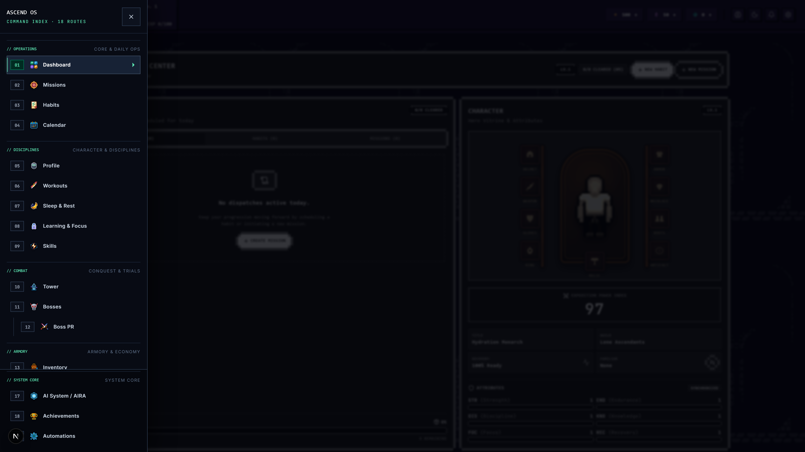 |
| *7-Stat radar, rank telemetry, active quests & beast companion* | *Radix-powered 19-route command index with 8-bit graphic icons* |

</div>

<br>

### 📁 Core Operations & Daily Routines
<div align="center">

| 🎯 02. Missions & Kanban Quests | 🔁 03. Habit Mastery & Heatmap |
| :---: | :---: |
|  |  |
| *3-Tier quest sizing, subtask checklists & status columns* | *Continuous mathematical habit strength & 365-day grid* |

| 📅 04. Unified Schedule Calendar | 👤 05. Hunter Profile & Credentials |
| :---: | :---: |
| 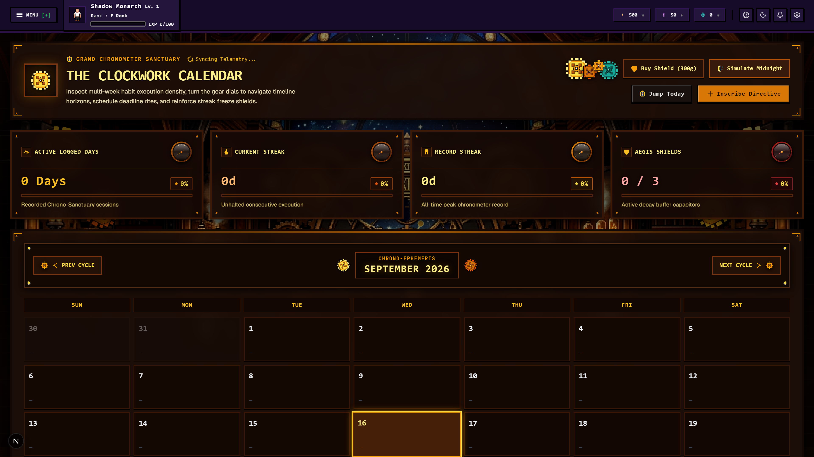 | 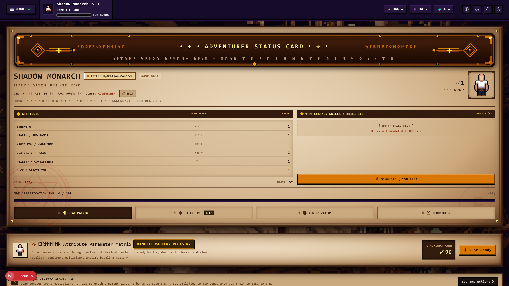 |
| *Integrated monthly timeline for habits, workouts & deadlines* | *Rank credentials, stat allocation matrix & equippable titles* |

</div>

<br>

### 🏋️ Disciplines & Cognitive Mastery
<div align="center">

| 🩻 06. Workouts & 16-Muscle Heatmap | 😴 07. Sleep & Circadian Recovery |
| :---: | :---: |
|  | 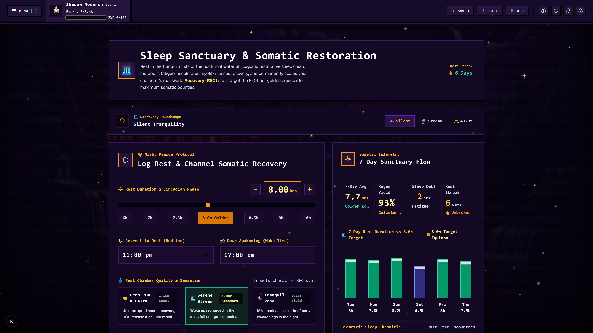 |
| *16-Muscle time-decay silhouette & 1RM gym logger* | *Circadian efficiency curve & Recovery (REC) stat scaling* |

| 🧠 08. Learning Sanctuary & Cyber Rain | 🌌 09. Class Skills & Constellations |
| :---: | :---: |
| 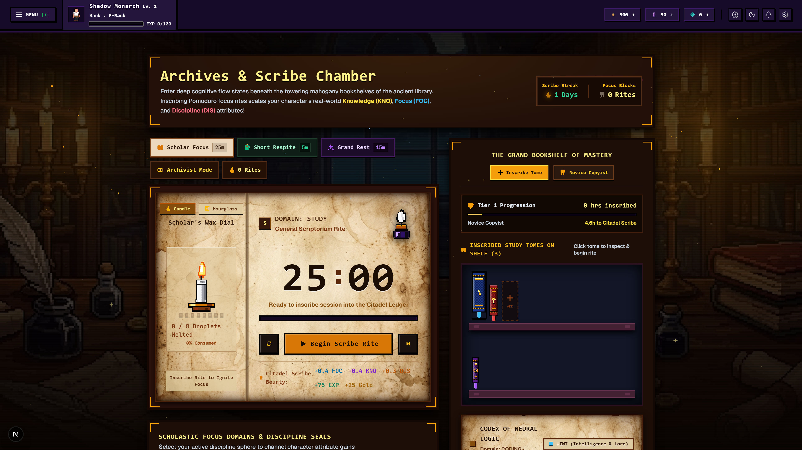 | 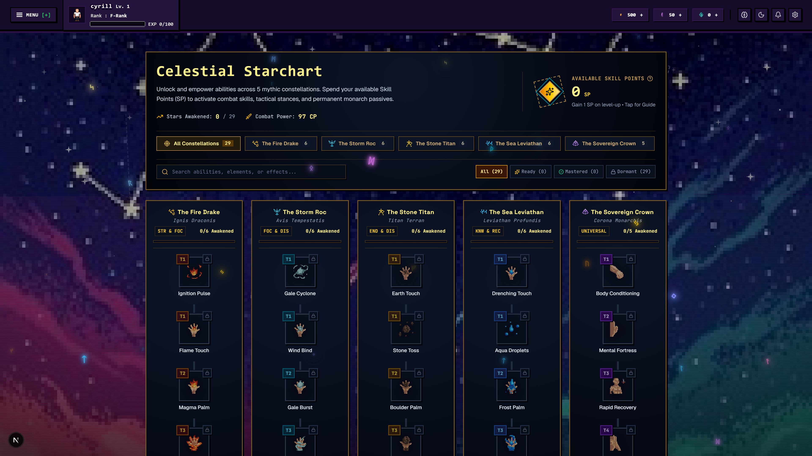 |
| *Pomodoro deep work timer & Persona 5 ambient audio player* | *Branching specialization trees spending SP on active/passive skills* |

</div>

<br>

### ⚔️ Combat Trials & Boss Gauntlets
<div align="center">

| 🏰 10. Tower of Ascension Gauntlet | 👹 11. World Bosses & Reality Raids |
| :---: | :---: |
|  | 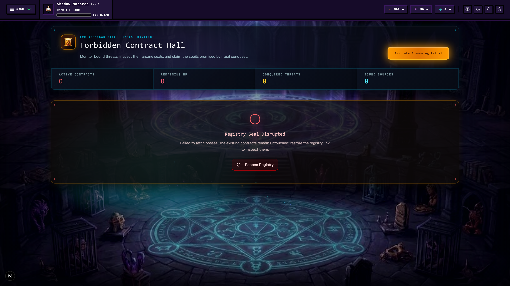 |
| *20-Floor auto-combat simulator & AIRA defeat analysis* | *Multi-month life goals damaged directly by real-world habits* |

| 🏆 12. Boss PR Breakthrough Arena | 🎒 13. Inventory & 9-Slot PaperDoll |
| :---: | :---: |
|  |  |
| *Compound lift PR milestones transformed into titanic boss battles* | *Visual gear matrix, item inspection tooltips & deep lore* |

</div>

<br>

### ⚒️ Armory, Economy & Draconic Beasts
<div align="center">

| ⚒️ 14. Blacksmith Forge & Crafting | 🏪 15. Armory Merchant & Provisions |
| :---: | :---: |
| 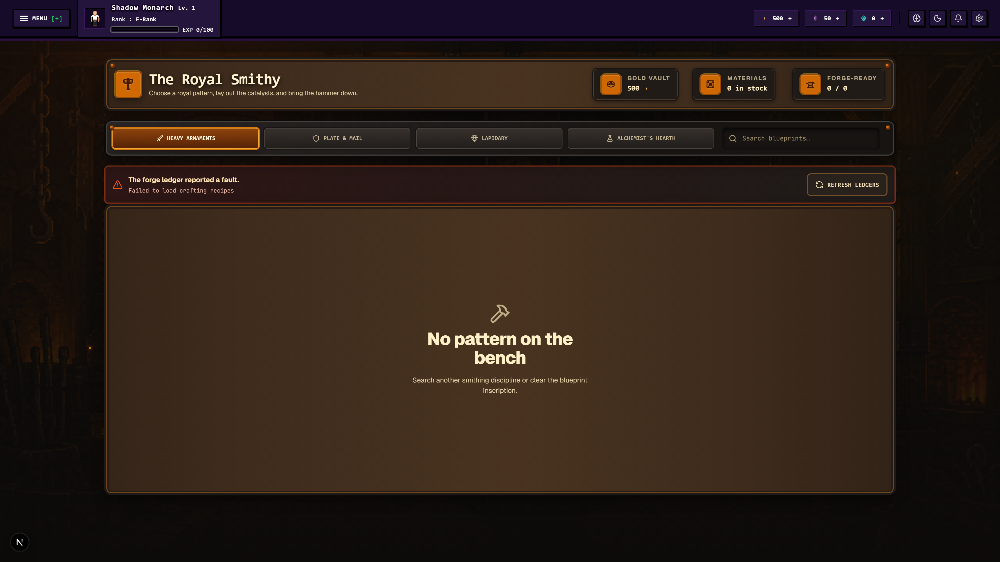 | 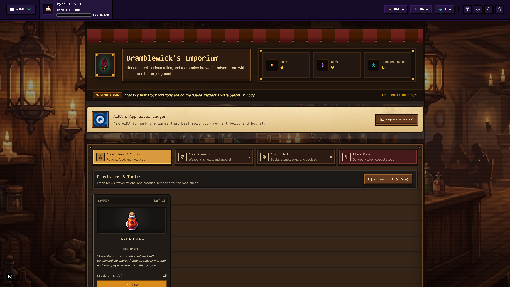 |
| *Recipe crafting, equipment refinement (+1 to +10) & salvage* | *Rotating daily stock, gold/gem sinks & mystery eggs* |

| 🐉 16. Beast Incubation & 20 Dragons | 🤖 17. AIRA Neural System Administrator |
| :---: | :---: |
|  |  |
| *Physical step incubation & 20 animated elemental dragons* | *Clinical AI advisor, predictive intelligence & mutative tool calling* |

</div>

<br>

### 🎖️ Milestones & Autonomous Automations
<div align="center">

| 🎖️ 18. Milestone Achievements Codex | ⚙️ 19. Autonomous System Automations |
| :---: | :---: |
| 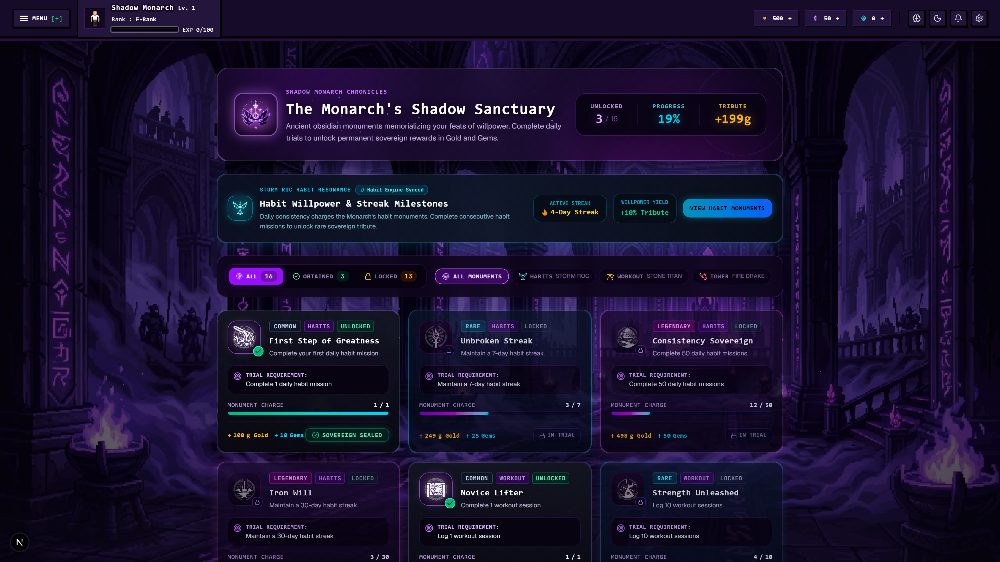 | 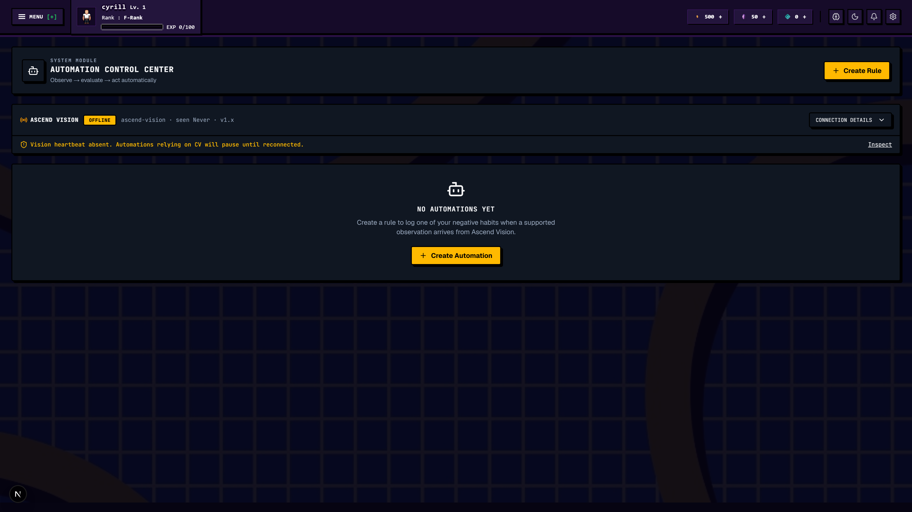 |
| *Tiered badges across Combat, Fitness, Discipline & Exploration* | *Event-driven rule triggers, habit evaluators & system workflows* |

</div>

---

## 🌟 Core Philosophy: The Reality vs. RPG Divide

Standard fitness and habit tracking apps suffer from an industry-wide **Day-30 retention cliff** (sub-4% retention) driven by **loss aversion**, **binary streak resets**, and the psychological **"What-the-Hell" effect**. A single missed day resets a counter to zero, causing users to abandon the habit entirely.

**Ascend Core completely solves this through architectural separation:**
1. **The Reality Layer (Real Life):** Real-world habits, compound gym lifts, deep work sessions, and sleep quality serve as the **training grounds** where player attributes are forged.
2. **The RPG Layer (The Tower & Gauntlets):** The simulated game world where stats are put to the test. You never defeat monsters by merely checking off a box—you conquer dungeons using the tangible power earned through real-world discipline.
3. **Algorithmic Mathematical Forgiveness:** Replaces fragile binary streak counters with an **asymptotic continuous habit strength curve** ($S_t \in [0.0, 1.0]$) and automated **Streak Freeze Shields**, preventing total momentum collapse on missed days.

---

## ⚡ Key Features & Sidebar Subsystems

Ascend Core organizes all user operations, disciplines, combat trials, economy, and system intelligence across **19 specialized sidebar subsystems**:

### 📁 // OPERATIONS (Core & Daily Ops)

#### 🖥️ 01. Dashboard (`/dashboard`)
* **Hunter Identity & Telemetry:** Real-time HUD tracking **Level**, **Class Archetype**, **Hunter Rank** (E-Rank through National Level SSS-Rank), **Power Score**, and **HP/EXP** progression.
* **Dual Currency Indicators:** Persistent tracking for soft currency (**Gold**) and premium currency (**Gems / Ascension Crystals**).
* **7-Attribute Radar Visualization:** Recharts-powered interactive radar measuring real-time equilibrium across **Strength**, **Knowledge**, **Discipline**, **Focus**, **Endurance**, **Recovery**, and **Consistency**.
* **Quick-Action Fast Logging:** Instant logging for daily habits, active quests, and step telemetry directly from the overview dashboard.

#### 🎯 02. Missions & Quest Log (`/missions`)
* **Kanban Quest Board:** Organize missions across *Pending*, *In Progress*, and *Completed* columns with smooth drag-and-drop animations.
* **3-Tier Quest Sizing:**
  * **Mini (Friction Baseline):** 10-15 minute task $\rightarrow$ $+15\text{ EXP}$, $+10\text{ Gold}$.
  * **Normal (Standard Quest):** 30-45 minute task $\rightarrow$ $+45\text{ EXP}$, $+25\text{ Gold}$.
  * **Elite (Major Objective):** 60+ minute major undertaking $\rightarrow$ $+120\text{ EXP}$, $+75\text{ Gold}$, $+0.5\text{ Stat Points}$.
* **Multi-Step Subtask Checklists:** Create rich missions with sub-checklists; checking off subtasks updates progress bars dynamically.

#### 🔁 03. Habit Mastery & Heatmap (`/habits`)
* **Continuous Habit Strength Curve:** Mathematical formulation eliminating binary streak resets:
  $$S_t = S_{t-1} + C_t \cdot \alpha \cdot (1 - S_{t-1}) - (1 - C_t) \cdot (1 - \delta) \cdot S_{t-1}$$
* **3-Tier Habit Sizing Architecture:** Set **Mini**, **Normal**, and **Elite** thresholds to maintain momentum on low-energy days.
* **GitHub-Style 365-Day Heatmap:** Visualizes daily execution density across all 365 days of the year.
* **Streak Freeze Shields:** Consumable shields that auto-deploy on missed days to preserve accumulated multipliers.

#### 📅 04. Unified Schedule Calendar (`/calendar`)
* **Unified Visual Timeline:** Combines scheduled habits, planned workout splits, and mission due dates into a single cohesive monthly/weekly view.
* **Historical Density Badges:** Inspect past completion records, logged workouts, and sleep quality scores for any date.

---

### 🏋️ // DISCIPLINES (Character & Disciplines)

#### 👤 05. Hunter Profile & Credentials (`/profile`)
* **Hunter License & Status Bar:** View official hunter rank credentials, lifetime statistics, and progression history.
* **Stat Allocation Matrix:** Spend unallocated stat points directly into STR, KNW, REC, DIS, END, FCS, and CON.
* **Equippable Milestone Titles:** Equip unlocked prestige titles (*"The Awakened"*, *"Void Conqueror"*, *"Titan of Iron"*) granting account-wide percentage multipliers.

#### 🦾 06. Workouts & 16-Muscle Heatmap (`/workouts`)
* **Active Gym Session Logger:** Log exercises, set types (**Warmup**, **Working Set**, **Drop Set**, **Failure**), weights, reps, and **RPE**.
* **16-Muscle Anatomical Heatmap:** Interactive vector model with computed **time-decay recovery physics** (48h standard, 72h compound muscle groups).
* **Brzycki 1RM Engine:** Dynamic calculation of Estimated One-Rep Max:
  $$\text{1RM} = \frac{\text{Weight}}{1.0278 - (0.0278 \times \text{Reps})}$$
* **AIRA Workout Intel:** Automatic plateau evaluation suggesting **+2.5 kg progressive overload** increments upon achieving $\ge 8$ clean repetitions.

#### 😴 07. Sleep & Rest Telemetry (`/sleep`)
* **Sleep Logger:** Track bedtime, wake time, total sleep duration, and perceived rest quality (1–5 stars).
* **Circadian Efficiency Curve:** Computes recovery efficiency against optimal circadian baseline (7.5–9 hours).
* **Recovery (REC) Stat Scaling:** High-efficiency sleep awards direct attribute bonuses to **Recovery** and accelerates anatomical muscle regeneration.

#### 🧠 08. Learning Sanctuary & Ambient Audio (`/learning`)
* **Pomodoro Deep Work Timer:** Configurable flow-state intervals (25m Focus / 5m Break / Custom) rewarding **Knowledge** and **Focus** attributes.
* **Cyber Rain Ambient Sound Player:** Built-in audio streamer with seamless looping of the official **Rainy Mood (Persona 5 - Beneath the Mask)** jazz track.
* **Generative Binaural Beats:** Features **432Hz deep space drone**, **4Hz theta waves**, and **14Hz beta wave focus pulses**.

#### 🌌 09. Skill Constellations & Specializations (`/skills`)
* **Branching Class Skill Trees:** Specialized constellation trees for *Warrior*, *Mage*, *Assassin*, *Paladin*, and *Shadow Monarch*.
* **Skill Points (SP):** Earn SP upon leveling up and invest into Active Combat Skills, Passive Multipliers, and Ultimate Abilities.
* **Interactive Node Modal:** Inspect cooldowns, mana costs, attribute scaling, and unlock prerequisites.

---

### ⚔️ // COMBAT (Conquest & Trials)

#### 🏰 10. Tower of Ascension (`/tower`)
* **20-Floor Tactical Gauntlet:** Battle through 3 themed dungeon sectors (*Iron Citadel*, *Sunken Archive*, *Void Monolith*) testing physical and mental thresholds.
* **Turn-Based Auto-Combat Simulator:** Calculates physical damage from **Strength**, spell damage from **Knowledge**, critical strikes from **Focus**, maximum HP from **Endurance**, and round regeneration from **Recovery**.
* **AIRA Defeat Diagnosis:** In-depth tactical autopsy report upon defeat explaining exact failure points and recommending specific attributes to train.

#### 👹 11. World Bosses & Reality Raids (`/bosses`)
* **Multi-Month Life Raids:** Transform monumental real-world goals (*"Defend Master's Thesis"*, *"Run a Marathon"*) into multi-phase raid bosses.
* **Habit-to-Boss Linking:** Checking off linked daily habits in real life deals direct damage to the boss's HP pool.
* **Phase Shifts & Enrage Timers:** Bosses transition through enraged states as HP depletes, driving urgency.

#### 🏆 12. Boss PR Breakthrough Arena (`/workouts/boss-pr`)
* **Personal Record Boss Encounters:** Heavy compound lifts (**Squat**, **Bench Press**, **Deadlift**, **Overhead Press**) become titanic boss encounters.
* **Breakthrough Damage:** Achieving a new 1RM deals massive critical damage, triggering celebratory confetti and high-tier loot.

---

### 🎒 // ARMORY (Armory & Economy)

#### 🎒 13. Inventory & 9-Slot PaperDoll (`/inventory`)
* **Interactive 9-Slot PaperDoll:** Visual gear matrix (`HELMET`, `WEAPON`, `OFF_HAND`, `ARMOR`, `GLOVES`, `BOOTS`, `RING`, `NECKLACE`, `ARTIFACT`).
* **Deep Item Lore & Modifiers:** Rich tooltips detailing item lore, equip requirements, and active stat modifiers.
* **Rarity Hierarchy:** `COMMON` $\rightarrow$ `RARE` $\rightarrow$ `EPIC` $\rightarrow$ `LEGENDARY` $\rightarrow$ `MYTHIC`.

#### ⚒️ 14. Forge & Crafting (`/crafting`)
* **Blacksmith Crafting:** Forge weapons, armor, and artifacts from monster shards and refined shadow steel ingots.
* **Equipment Refinement:** Enhance gear from **+1 to +10** to scale base attributes.
* **Gear Salvaging:** Dismantle obsolete gear into refinement shards and gold.

#### 🏪 15. Merchant Shop & Economy (`/shop`)
* **Rotating Daily Market:** Browse equipment, potions, mystery beast eggs, and streak shields with daily stock limits.
* **Dual Currency Balance:** Balanced economy with repair fees, refinement costs, and egg purchases preventing gold inflation.

#### 🐉 16. Beast Incubation & 20 Dragons (`/beasts`)
* **Kinetic & Step Incubation:** Real-world walking steps and workout caloric expenditure incubate mystery elemental beast eggs.
* **20 Unique Dragon Species:** Complete catalog of animated elemental dragons (`beast_1.gif` to `beast_20.gif`) spanning 7 elemental affinities (**Void**, **Nature**, **Frost**, **Fire**, **Cyber**, **Holy**, **Storm**).
* **Companion Leveling:** Feed accumulated steps and gold to level companions up to Level 10, scaling passive buffs from **+6% up to +50%**.

---

### ⚙️ // SYSTEM CORE (System Core & Intelligence)

#### 🤖 17. AI System / AIRA (`/aira`)
* **Clinical System Persona:** Unemotional, data-driven AI advisor inspired by *Solo Leveling's System* and *Ciel / Raphael*.
* **Proactive Contextual Notifications:** Real-time toast notifications (`useAiraNotification.ts`) delivering circadian briefings, midnight decay warnings, and anatomical readiness alerts.
* **Mutative Tool Calling:** Autonomously generates customized workout routines, creates habit schedules, and logs completed quests directly via the **Google Gemini API**.

#### 🎖️ 18. Milestone Achievements Codex (`/achievements`)
* **Structured Milestone Trophies:** Track progress across Combat, Fitness, Discipline, Knowledge, and Exploration.
* **Account Perks:** Unlocks gems, exclusive hunter titles, and permanent account multipliers.

#### ⚙️ 19. Automations Engine (`/automations`)
* **Event-Driven Rules Engine:** Configure automation triggers linking habit completions to notifications, streak evaluations, and custom system webhooks.
* **Daily System Surges:** Automated daily directives including **5x Habit 2x Boosts**, **1x Learning 2x Boost**, **1x Workout 2x Surge**, and **Free Daily Egg Claims**.

---

## 🏗️ System Architecture

```mermaid
flowchart TB
    subgraph Frontend["🖥️ ASCEND CORE FRONTEND (Next.js 16 App Router)"]
        UI["Cyberpunk & 8-Bit Neo-Retro HUD"]
        SidebarNav["19-Route Sidebar Navigation Index"]
        Zustand["Zustand State Stores (15+ Modular Stores)"]
        Heatmap["Interactive 16-Muscle SVG Heatmap"]
        Audio["Web Audio SFX Engine & Cyber Rain Player"]
        PaperDoll["9-Slot PaperDoll Equipment Matrix"]
        Kanban["Drag & Drop Kanban Quest Board"]
        AutomationsUI["Event-Driven Automations Engine"]
    end

    subgraph API_Bridge["🌐 API & SERVERLESS BRIDGE"]
        RestAPI["REST API (FastAPI Endpoints)"]
        VercelHandler["Vercel Serverless Wrapper (api/index.py)"]
    end

    subgraph Backend["⚙️ ASCEND CORE BACKEND (FastAPI + Python 3.12)"]
        DecayEngine["Real-Time Time-Decay Muscle Engine"]
        FitnessEngine["Brzycki 1RM & Progressive Overload Engine"]
        CombatSim["Turn-Based Auto-Combat Simulator"]
        AiraAI["AIRA Neural System Administrator (Gemini AI)"]
        BeastIncubator["Draconic Step & Energy Incubator"]
        CraftingEngine["Item Refinement & Blacksmith Pipeline"]
        AutomationsEngine["Event-Driven Trigger & Webhook Engine"]
        EconomyEngine["Dual-Currency & Anti-Inflation Sinks"]
    end

    subgraph Storage["🗄️ PERSISTENCE ENGINE (Prisma ORM)"]
        DB[(PostgreSQL / SQLite dev.db)]
        PrismaClient["Prisma Client Python (35+ Relational Models)"]
    end

    Frontend --> API_Bridge
    API_Bridge --> Backend
    Backend --> PrismaClient
    PrismaClient --> DB
```

---

## 🧰 Tech Stack

| Layer | Technologies |
| :--- | :--- |
| **Frontend Framework** | [Next.js 16 (App Router)](https://nextjs.org/) with [React 19](https://react.dev/) |
| **Language** | [TypeScript 5](https://www.typescriptlang.org/) (Strict mode) |
| **Styling & Theme** | [Tailwind CSS v4](https://tailwindcss.com/), PostCSS, [NES.css](https://nostalgic-css.github.io/NES.css/) (8-Bit Accents) |
| **Animations & FX** | [Framer Motion 12](https://www.framer.com/motion/), [GSAP](https://greensock.com/gsap/), Canvas-Confetti |
| **Component Primitives**| [Radix UI](https://www.radix-ui.com/), [Base UI](https://base-ui.com/), Lucide Icons |
| **State Management** | [Zustand 5](https://github.com/pmndrs/zustand) (Modular Domain Stores with Optimistic Updates) |
| **Data Visualization** | [Recharts](https://recharts.org/), Custom SVG 16-Muscle Heatmap, React Calendar Heatmap |
| **Backend Framework** | [FastAPI](https://fastapi.tiangolo.com/) (Python 3.12+ Async Engine) |
| **Server Engine** | [Uvicorn](https://www.uvicorn.org/) ASGI with custom lifespan connection pool |
| **ORM & Database** | [Prisma Client Python](https://prisma-client-py.readthedocs.io/) with [PostgreSQL](https://neon.tech/) / [SQLite](https://sqlite.org/) |
| **Validation & Types** | [Pydantic v2](https://docs.pydantic.dev/) |
| **AI Intelligence** | [Google Generative AI (Gemini 2.5 / 3)](https://ai.google.dev/) for AIRA System Intelligence |
| **Security & Auth** | Passwords hashed with bcrypt, JWT tokens, Resend OTP email verification |
| **Quality & Testing** | [Vitest](https://vitest.dev/), [Playwright](https://playwright.dev/), [ESLint 9](https://eslint.org/), [Prettier](https://prettier.io/), [Husky](https://typicode.github.io/husky/) |

---

## 📦 Prerequisites

Ensure you have the following installed on your development machine:
* **Node.js:** `v20.0.0+` (LTS recommended)
* **Python:** `v3.10+` (`v3.12+` recommended)
* **npm:** `v10.0+` or **pnpm**
* **Git**
* **Google Gemini API Key:** *(Optional, required for AIRA conversational intelligence & coaching)*
* **Resend API Key:** *(Optional, required for sending email verification OTPs)*

---

## 🚀 Getting Started

### 1. Clone the Repository
```bash
git clone https://github.com/RIll-cmd/ascend-core.git
cd ascend-core
```

---

### 2. Backend Setup (`server/`)

```bash
# 1. Navigate to the backend directory
cd server

# 2. Create and activate a Python virtual environment
python -m venv venv

# Windows (PowerShell):
.\venv\Scripts\Activate.ps1

# macOS / Linux:
source venv/bin/activate

# 3. Install Python dependencies
pip install -r requirements.txt

# 4. Configure environment variables
cp .env.example .env

# 5. Push database schema and generate Prisma client
prisma db push
prisma generate

# 6. Start the FastAPI development server
python main.py
```
> ⚡ *The FastAPI server will start on `http://localhost:8000`.*
> 📖 *Interactive Swagger API documentation is available at `http://localhost:8000/docs`.*

---

### 3. Frontend Setup (`client/`)

Open a new terminal tab/window:

```bash
# 1. Navigate to the client directory
cd client

# 2. Install dependencies
npm install

# 3. Configure environment variables
cp .env.example .env.local

# 4. Start the Next.js development server
npm run dev
```
> 🌐 *The web application will be accessible at `http://localhost:3000`.*

---

## 🔐 Environment Variables

### Backend Configuration (`server/.env`)
| Variable | Required | Default | Description |
| :--- | :---: | :---: | :--- |
| `DATABASE_URL` | **Yes** | `"file:./dev.db"` | PostgreSQL connection string or SQLite file path |
| `DATABASE_URL_UNPOOLED` | Optional | `""` | Direct non-pooling URL for migrations (e.g., Neon direct) |
| `GEMINI_API_KEY` | Optional | `""` | Google Gemini API key for AIRA AI analysis & tool calling |
| `RESEND_API_KEY` | Optional | `""` | Resend API key for sending email verification codes |
| `JWT_SECRET` | Optional | `"ascend-secret-key"` | Secret key used to sign and verify JWT authentication tokens |
| `INTEGRATION_API_KEY` | Optional | `""` | Secret key for external automated webhooks & background workers |

### Frontend Configuration (`client/.env.local`)
| Variable | Required | Default | Description |
| :--- | :---: | :---: | :--- |
| `NEXT_PUBLIC_API_URL` | **Yes** | `http://localhost:8000` | Backend API base URL |
| `NEXT_PUBLIC_APP_URL` | Optional | `http://localhost:3000` | Client URL for share links, redirects, and meta tags |

---

## 📂 Project Structure

```
ascend-core/
├── api/                                # Serverless Cloud Deployment Entrypoints
│   ├── index.py                        # Vercel serverless Python handler
│   └── requirements.txt                # Vercel serverless dependencies
├── client/                             # Frontend Next.js 16 Web Application
│   ├── public/                         # Static Assets & Media
│   │   ├── beasts/                     # 20 animated dragon GIFs & sprites
│   │   ├── eggs/                       # Elemental beast egg sprites
│   │   ├── icons/                      # 400+ RPG item & skill icons
│   │   ├── music/                      # Ambient soundscapes (Cyber Rain, 432Hz)
│   │   ├── previews/                   # 20 high-res UI screenshots across all routes
│   │   ├── screenshots/                # System toast and bonus hub captures
│   │   └── sounds/                     # Web Audio SFX & AIRA voice files
│   ├── src/
│   │   ├── app/                        # Next.js App Router (Layouts & Feature Pages)
│   │   │   ├── (auth)/                 # Login, Register, OTP verification
│   │   │   ├── (dashboard)/            # 19 Authenticated Sidebar Modules
│   │   │   │   ├── dashboard/          # 01. Command Center Overview HUD
│   │   │   │   ├── missions/           # 02. Daily quest log & Kanban board
│   │   │   │   ├── habits/             # 03. Habit manager & 365-day heatmap
│   │   │   │   ├── calendar/           # 04. Habit & workout schedule calendar
│   │   │   │   ├── profile/            # 05. Hunter credentials & Titles
│   │   │   │   ├── workouts/           # 06. Active gym session & set logger
│   │   │   │   │   └── boss-pr/        # 12. Boss PR Breakthrough Arena
│   │   │   │   ├── sleep/              # 07. Circadian sleep efficiency logger
│   │   │   │   ├── learning/           # 08. Pomodoro timer & Cyber Rain player
│   │   │   │   ├── skills/             # 09. Class specializations & SP Skill Tree
│   │   │   │   ├── tower/              # 10. 20-Floor Tower of Ascension
│   │   │   │   ├── bosses/             # 11. Epic Goal Reality Raids
│   │   │   │   ├── inventory/          # 13. PaperDoll 9-slot gear grid & vault
│   │   │   │   ├── crafting/           # 14. Blacksmith recipes & refinement
│   │   │   │   ├── shop/               # 15. Rotating daily market
│   │   │   │   ├── beasts/             # 16. Beast Incubator & 20-Dragon Bestiary
│   │   │   │   ├── aira/               # 17. AIRA Conversational Terminal
│   │   │   │   ├── achievements/       # 18. Milestone & Domain achievements
│   │   │   │   └── automations/        # 19. Event triggers & System workflows
│   │   ├── components/                 # Global UI, Layouts & 8-Bit Design Suite
│   │   │   ├── layouts/                # DashboardLayout, Topbar, SidebarNav
│   │   │   └── ui/8bit/                # 8-Bit retro RPG components & borders
│   │   ├── features/                   # Domain-Driven Modular Components
│   │   │   ├── aira/                   # AIRA AI coach & toast notification hooks
│   │   │   ├── beasts/                 # Egg incubation, leveling & codex
│   │   │   ├── bosses/                 # Raid encounters & PR benchmarks
│   │   │   ├── fitness/                # 16-Muscle heatmap & 1RM calculator
│   │   │   ├── habits/                 # Continuous math engine & streaks
│   │   │   ├── inventory/              # PaperDoll grid & item inspect modal
│   │   │   ├── learning/               # Pomodoro timer & audio streamer
│   │   │   └── sleep/                  # Circadian telemetry & recovery curve
│   │   ├── store/                      # Zustand State Management Stores (15+ stores)
│   │   └── types/                      # TypeScript definitions & API contracts
│   ├── scripts/
│   │   └── capture_screenshots.ts      # Automated Playwright full-suite capture script
│   ├── package.json                    # Frontend dependencies & scripts
│   └── tsconfig.json                   # TypeScript compiler configuration
├── server/                             # Backend FastAPI Core Engine
│   ├── prisma/
│   │   ├── schema.prisma               # 35+ Model Relational Database Schema
│   │   └── dev.db                      # Local development SQLite database
│   ├── routers/                        # 20+ Domain REST Endpoints
│   │   ├── auth.py                     # Authentication & JWT tokens
│   │   ├── character.py                # Character stats & progression
│   │   ├── habits.py                   # Habit CRUD & strength decay
│   │   ├── workouts.py                 # Set logging & 1RM formulas
│   │   ├── fitness.py                  # Anatomical muscle fatigue decay
│   │   ├── tower.py                    # Dungeon combat calculations
│   │   ├── aira.py                     # Gemini AI coaching & tool calling
│   │   ├── beasts.py                   # Step sync & egg hatching
│   │   ├── crafting.py                 # Refinement & forge recipes
│   │   ├── shop.py                     # Rotating market items
│   │   ├── automations.py              # Event triggers & daily boosts
│   │   └── calendar.py                 # Schedule sync & timeline events
│   ├── schemas/                        # Pydantic v2 Request/Response Schemas
│   ├── services/                       # Mathematical & Simulation Engines
│   ├── auth_utils.py                   # Password hashing & JWT helpers
│   ├── main.py                         # FastAPI application factory & CORS configuration
│   └── requirements.txt                # Python backend dependencies
├── docs/                               # System blueprints & architectural documents
│   └── media/                          # High-resolution documentation screenshots
├── vercel.json                         # Vercel deployment configuration
└── README.md                           # Master Project Documentation
```

---

## 🧪 Automated Testing

### Backend Unit & Integration Tests
```bash
cd server

# Run domain verification suites
python -u scripts/test_muscle_recovery.py
python -u scripts/test_fitness_api.py
python -u scripts/test_beasts.py
python -u scripts/test_weekly_boss.py
```

### Frontend Typechecking, Linting & Unit Tests
```bash
cd client

# Run Vitest test suite
npm run test

# Run ESLint validation
npm run lint

# Compile production Next.js build
npm run build

# Capture automated Playwright documentation screenshots across all 19 routes
npm run screenshots
```

---

## 🚢 Deployment

### Production Architecture (Vercel & Neon Serverless)
Ascend OS is engineered exclusively for **Vercel** compute/hosting and **Neon** serverless database storage:
1. **Compute & API (Vercel):** Frontend assets (`client/`) and Python backend endpoints (`server/` via `api/index.py`) are hosted entirely as serverless functions on Vercel.
2. **Database (Neon PostgreSQL):** Persistent data storage is powered exclusively by Neon Serverless PostgreSQL with connection pooling (`-pooler`).
3. **Region Pairing:** Vercel functions are paired in region `sin1` (Singapore) matching Neon AWS region `aws-ap-southeast-1` to minimize latency.
4. **Automated Crons:** Background maintenance tasks (heartbeats, sweeps, midnight decay) are scheduled via Vercel Cron Jobs (`vercel.json`) invoking `/api/cron/*` endpoints guarded by `CRON_SECRET`.

#### Deployment Steps:
1. Push the repository to GitHub.
2. Import the project into [Vercel](https://vercel.com).
3. Set the Root Directory to `./` with the **Next.js** preset.
   Keep the install and build commands from `vercel.json`: install with `npm ci --include=dev && npm ci --prefix client --include=dev`, then build with `npm run build`. Leave Output Directory at the Next.js default. The first install makes Next.js resolvable from the project root; the second installs the frontend's locked dependencies. Commit both the root `package-lock.json` and `client/package-lock.json`. Installing only with `--prefix client` causes Vercel's root-level Next.js version detection to fail even when `next` is declared in the root manifest. Do not change Root Directory to `client`, as this deployment also uses the root Python API and cron configuration.
4. Configure required environment variables in the Vercel Dashboard:
   - `DATABASE_URL` (Neon pooled endpoint: `postgresql://...-pooler.../neondb?sslmode=require`)
   - `DATABASE_URL_UNPOOLED` (Neon direct endpoint)
   - `CRON_SECRET` (Secure token for Vercel Cron authorization)
   - `SECRET_KEY` (JWT signing secret)
   - `GEMINI_API_KEY` (AIRA AI integration)
5. Deploy. Vercel automatically deploys the Next.js frontend, Python serverless API functions, and registers the Vercel Cron schedules.

---

## 📜 License

This project is licensed under the **[MIT License](LICENSE)**.

<div align="center">
  <sub>Built with relentless discipline for Ascendants pursuing physical, cognitive, and personal mastery.</sub>
</div>
