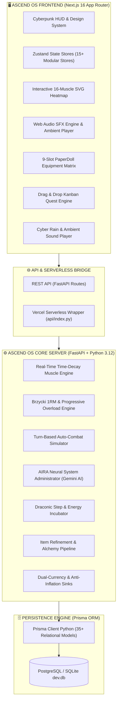

<div align="center">

# 🌌 ASCEND CORE
### The Next-Generation Gamified Self-Mastery & Physical Evolution Operating System

[](https://nextjs.org/)
[](https://react.dev/)
[](https://www.typescriptlang.org/)
[](https://tailwindcss.com/)
[](https://fastapi.tiangolo.com/)
[](https://python.org/)
[](https://prisma.io/)
[](https://neon.tech/)
[](https://opensource.org/licenses/MIT)

<p align="center">
  <em>Transform real-world workouts, habit streaks, cognitive deep work, and sleep hygiene into a tactical progression RPG. Ascend OS bridges real-world effort (The Reality Layer) with a deep simulated game world (The RPG Layer) to eliminate burnout, overcome the 30-day retention cliff, and turn daily mastery into an epic solo ascension.</em>
</p>

[Visual Showcase](#-visual-showcase) • [Key Features](#-key-features) • [System Architecture](#-system-architecture) • [Getting Started](#-getting-started) • [Environment Variables](#-environment-variables) • [Project Structure](#-project-structure) • [Testing](#-automated-testing) • [License](#-license)

---

</div>

## 🖼️ Visual Showcase

### Command Center & High-Density HUD


<div align="center">

| 🩻 16-Muscle Anatomical Heatmap & Workout | ⚔️ Tower of Ascension Gauntlet |
| :---: | :---: |
|  |  |
| *16-muscle anatomical time-decay silhouette & 1RM gym logger* | *20-Floor tactical turn-based auto-combat dungeon crawl* |

| 🔁 Habit Mastery & Continuous Math | 🏆 Boss PR Breakthrough Arena |
| :---: | :---: |
|  |  |
| *3-tier sizing, 365-day heatmap & streak freeze shields* | *Transform heavy compound lift records into titanic boss encounters* |

| 🐉 Beast Incubation & 20 Dragons | 🧙 9-Slot PaperDoll Equipment |
| :---: | :---: |
|  |  |
| *Step incubation & 20 elemental animated dragon companions* | *9-Slot equipment grid, item lore tooltips, & stat modifiers* |

| ⚡ Daily System Surges & Boosts | 👑 Weekly Epic Directives Hub |
| :---: | :---: |
|  |  |
| *Auto-applying 2x Habit, Learning & Workout Surges* | *Weekly PR Boss confrontation & 40k step quotas* |

| 🤖 AIRA Neural System & Contextual Notifications |
| :---: |
|  |
| *Conversational AI administrator, tool calling, and live contextual system briefings* |

</div>

---

## 🌟 Core Philosophy: The Reality vs. RPG Divide

Standard fitness and habit tracking apps suffer from an industry-wide **Day-30 retention cliff** (sub-4% retention) driven by **loss aversion**, **binary streak resets**, and the psychological **"What-the-Hell" effect**. A single missed day resets a counter to zero, causing users to abandon the habit entirely.

**Ascend OS completely solves this through architectural separation:**
1. **The Reality Layer (Real Life):** Real-world habits, compound gym lifts, deep work sessions, and sleep quality serve as the **training grounds** where player attributes are forged.
2. **The RPG Layer (The Tower & Gauntlets):** The simulated game world where stats are put to the test. You never defeat monsters by merely checking off a box—you conquer dungeons using the tangible power earned through real-world discipline.
3. **Algorithmic Mathematical Forgiveness:** Replaces fragile binary streak counters with an **asymptotic continuous habit strength curve** ($S_t \in [0.0, 1.0]$) and automated **Streak Freeze Shields**, preventing total momentum collapse on missed days.

---

## ⚡ Key Features

### 🖥️ 1. Command Center & Hunter HUD
* **Hunter Identity & Telemetry:** Real-time HUD tracking **Level**, **Class Archetype**, **Hunter Rank** (E-Rank through National Level SSS-Rank), **Power Score**, and **HP/EXP** progression.
* **Dual Currency Indicators:** Persistent tracking for soft currency (**Gold**) and premium currency (**Gems / Ascension Crystals**).
* **7-Attribute Radar Visualization:** Recharts-powered interactive radar measuring real-time equilibrium across **Strength**, **Knowledge**, **Discipline**, **Focus**, **Endurance**, **Recovery**, and **Consistency**.
* **Quick-Action Fast Logging:** Instant logging for daily habits, active quests, and step telemetry directly from the overview dashboard.

### 🏋️ 2. Workout Tracker & 16-Muscle Anatomical Heatmap
* **Active Gym Session Logger:** Log exercises, set categories (**Warmup**, **Working Set**, **Drop Set**, **Failure**), weights, reps, and **RPE** (Rating of Perceived Exertion).
* **16-Muscle Anatomical Heatmap:** Interactive front/back vector anatomical model with computed real-time **time-decay recovery physics** (48h standard recovery, 72h compound muscle groups).
* **Brzycki 1RM Engine:** Dynamic calculation of Estimated One-Rep Max:
  $$\text{1RM} = \frac{\text{Weight}}{1.0278 - (0.0278 \times \text{Reps})}$$
* **AIRA Workout Intel:** Automatic plateau evaluation suggesting **+2.5 kg progressive overload** increments when hitting $\ge 8$ clean repetitions.

### 🔁 3. Asymptotic Habit Engine & Streak Shields
* **Continuous Habit Strength Curve:** Algorithmic formula preserving long-term consistency over binary all-or-nothing streaks:
  $$S_t = S_{t-1} + C_t \cdot \alpha \cdot (1 - S_{t-1}) - (1 - C_t) \cdot (1 - \delta) \cdot S_{t-1}$$
* **3-Tier Sizing Architecture:** Set **Mini** (friction baseline), **Normal** (standard goal), and **Elite** (peak performance) thresholds to maintain momentum on low-energy days.
* **GitHub-Style 365-Day Heatmap:** Scannable annual execution density grid visualizing daily consistency.
* **Streak Freeze Shields:** Consumable shields that auto-deploy on missed days to safeguard accumulated multipliers.


### 🤖 4. AIRA Neural System Administrator
* **Clinical System Persona:** Unemotional, data-driven AI advisor inspired by *Solo Leveling's System* and *Ciel / Raphael*, providing concise actionable directives.
* **Proactive Contextual Notifications:** Real-time toast alerts (`useAiraNotification.ts`) delivering circadian status briefings, midnight decay warnings, and muscle readiness alerts.
* **Predictive Combat Intelligence:** Assesses player attribute preparedness before dungeon challenges and delivers tactical autopsy reports upon defeat.
* **Mutative Tool Calling:** Generates personalized workout programs, schedules habits, and logs quests directly on user confirmation via the **Google Gemini API**.


### ⚔️ 5. Tower of Ascension & Boss PR Arena
* **20-Floor Dungeon Gauntlet:** 3 thematic sectors (*Iron Citadel*, *Sunken Archive*, *Void Monolith*) testing physical, cognitive, and recovery thresholds.
* **Turn-Based Auto-Combat Simulator:** Formulas calculating physical damage from **Strength**, magic penetration from **Knowledge**, critical rate from **Focus**, maximum HP from **Endurance**, and round regeneration from **Recovery**.
* **Personal Record Boss Battles:** Heavy compound lifts (**Squat**, **Bench Press**, **Deadlift**, **Overhead Press**) become titanic boss encounters where breaking PR records deals critical finishing blows.

<div align="center">
  
</div>

### 👹 6. Epic Goal Reality Raids
* **Multi-Month Life Milestones:** Transform long-term achievements (e.g., *Defending a Thesis*, *Running a Marathon*, *Debt Elimination*) into multi-phase raid bosses.
* **Habit-to-Boss Linking:** Direct damage applied to the boss's HP pool every time linked daily habits are checked off in the physical world.
* **Enrage Mechanics & Phase Shifts:** Dynamic boss phases and countdown timers reinforcing real-world commitment.

### 🐉 7. Beast Incubation & 20-Dragon Bestiary
* **Kinetic & Step Incubation:** Real-world steps and active workout caloric burn hatch mystery elemental beast eggs.
* **20 Unique Dragon Species:** Animated elemental dragons (`beast_1.gif` through `beast_20.gif`) spanning **Void**, **Nature**, **Frost**, **Fire**, **Cyber**, **Holy**, and **Storm** lineages.
* **Leveling & Passive Scaling:** Feed steps and gold to scale companions up to Level 10, unlocking passive attribute buffs from **+6% up to +50%**.

<div align="center">
  
</div>

### 🎒 8. PaperDoll Inventory, Blacksmith Forge & Shop
* **Interactive 9-Slot PaperDoll:** Visual gear grid (`HELMET`, `WEAPON`, `OFF_HAND`, `ARMOR`, `GLOVES`, `BOOTS`, `RING`, `NECKLACE`, `ARTIFACT`).
* **Blacksmith Crafting & Refinement:** Craft high-tier gear using monster shards and refine equipment from **+1 to +10** to boost base attributes.
* **Dual-Currency Market:** Rotating daily inventory featuring equipment, mystery beast eggs, stat elixirs, and streak shields with anti-inflation sinks.

<div align="center">

| ⚒️ Blacksmith Forge & Crafting | 🏪 Rotating Armory & Provisions |
| :---: | :---: |
|  |  |

</div>

### 🧠 9. Focus Sanctuary & Cyber Rain Soundscapes
* **Pomodoro Deep Work Timer:** Flow-state intervals with automatic stat allocation into **Knowledge** and **Focus** upon session completion.
* **Cyber Rain Ambient Sound Player:** Integrated audio streamer with seamless looping of the official **Rainy Mood (Persona 5 - Beneath the Mask)** jazz ambiance.
* **Generative Binaural Audio:** Built-in **432Hz deep space resonance**, **4Hz theta waves**, and **14Hz beta wave focus pulses**.

<div align="center">
  
</div>

### 😴 10. Circadian Sleep & Recovery Telemetry
* **Circadian Efficiency Curve:** Evaluates bedtime, wake time, and perceived rest quality against optimal circadian windows.
* **Recovery (REC) Stat Scaling:** High-efficiency sleep rewards direct attribute bonuses to **Recovery** and accelerates anatomical muscle recovery.

### ⚡ 11. Daily System Surges & Weekly Epic Directives
* **Daily Auto-Applying Boosts:** Automatic **2x Habit Multipliers**, **2x Learning Focus Boosts**, **2x Workout Surges**, and **Free Daily Egg Claims**.
* **Weekly Epic Directives:** High-stakes weekly quotas rewarding large quantities of EXP, Gold, and rare Streak Freeze Shields.

---

## 🏗️ System Architecture



---

## 🧰 Tech Stack

| Layer | Technologies |
| :--- | :--- |
| **Frontend Framework** | [Next.js 16 (App Router)](https://nextjs.org/) with [React 19](https://react.dev/) |
| **Language** | [TypeScript 5](https://www.typescriptlang.org/) (Strict mode) |
| **Styling & Theme** | [Tailwind CSS v4](https://tailwindcss.com/), PostCSS, [NES.css](https://nostalgic-css.github.io/NES.css/) (8-Bit Accents) |
| **Animations & FX** | [Framer Motion 12](https://www.framer.com/motion/), [GSAP](https://greensock.com/gsap/), Canvas-Confetti |
| **Component Primitives**| [Radix UI](https://www.radix-ui.com/), [Base UI](https://base-ui.com/), Lucide Icons |
| **State Management** | [Zustand 5](https://github.com/pmndrs/zustand) (Modular Domain Stores with Optimistic Updates) |
| **Data Visualization** | [Recharts](https://recharts.org/), Custom SVG 16-Muscle Heatmap, React Calendar Heatmap |
| **Backend Framework** | [FastAPI](https://fastapi.tiangolo.com/) (Python 3.12+ Async Engine) |
| **Server Engine** | [Uvicorn](https://www.uvicorn.org/) ASGI with custom lifespan management |
| **ORM & Database** | [Prisma Client Python](https://prisma-client-py.readthedocs.io/) with [PostgreSQL](https://neon.tech/) / [SQLite](https://sqlite.org/) |
| **Validation & Types** | [Pydantic v2](https://docs.pydantic.dev/) |
| **AI Intelligence** | [Google Generative AI (Gemini 2.5 / 3)](https://ai.google.dev/) for AIRA System Intelligence |
| **Security & Auth** | Passwords hashed with bcrypt, JWT tokens, Resend OTP email verification |
| **Quality & Testing** | [Vitest](https://vitest.dev/), [Playwright](https://playwright.dev/), [ESLint 9](https://eslint.org/), [Prettier](https://prettier.io/), [Husky](https://typicode.github.io/husky/) |

---

## 📦 Prerequisites

Ensure you have the following installed on your development machine:
* **Node.js:** `v20.0.0+` (LTS recommended)
* **Python:** `v3.10+` (`v3.12+` recommended)
* **npm:** `v10.0+` or **pnpm**
* **Git**
* **Google Gemini API Key:** *(Optional, required for AIRA conversational intelligence & coaching)*
* **Resend API Key:** *(Optional, required for sending email verification OTPs)*

---

## 🚀 Getting Started

### 1. Clone the Repository
```bash
git clone https://github.com/RIll-cmd/ascend-core.git
cd ascend-core
```

---

### 2. Backend Setup (`server/`)

```bash
# 1. Navigate to the backend directory
cd server

# 2. Create and activate a Python virtual environment
python -m venv venv

# Windows (PowerShell):
.\venv\Scripts\Activate.ps1

# macOS / Linux:
source venv/bin/activate

# 3. Install Python dependencies
pip install -r requirements.txt

# 4. Configure environment variables
cp .env.example .env

# 5. Push database schema and generate Prisma client
prisma db push
prisma generate

# 6. Start the FastAPI development server
python main.py
```
> ⚡ *The FastAPI server will start on `http://localhost:8000`.*
> 📖 *Interactive Swagger API documentation is available at `http://localhost:8000/docs`.*

---

### 3. Frontend Setup (`client/`)

Open a new terminal tab/window:

```bash
# 1. Navigate to the client directory
cd client

# 2. Install dependencies
npm install

# 3. Configure environment variables
cp .env.example .env.local

# 4. Start the Next.js development server
npm run dev
```
> 🌐 *The web application will be accessible at `http://localhost:3000`.*

---

## 🔐 Environment Variables

### Backend Configuration (`server/.env`)
| Variable | Required | Default | Description |
| :--- | :---: | :---: | :--- |
| `DATABASE_URL` | **Yes** | `"file:./dev.db"` | PostgreSQL connection string or SQLite file path |
| `DATABASE_URL_UNPOOLED` | Optional | `""` | Direct non-pooling URL for migrations (e.g., Neon direct) |
| `GEMINI_API_KEY` | Optional | `""` | Google Gemini API key for AIRA AI analysis & tool calling |
| `RESEND_API_KEY` | Optional | `""` | Resend API key for sending email verification codes |
| `JWT_SECRET` | Optional | `"ascend-secret-key"` | Secret key used to sign and verify JWT authentication tokens |
| `INTEGRATION_API_KEY` | Optional | `""` | Secret key for external automated webhooks & background workers |

### Frontend Configuration (`client/.env.local`)
| Variable | Required | Default | Description |
| :--- | :---: | :---: | :--- |
| `NEXT_PUBLIC_API_URL` | **Yes** | `http://localhost:8000` | Backend API base URL |
| `NEXT_PUBLIC_APP_URL` | Optional | `http://localhost:3000` | Client URL for share links, redirects, and meta tags |

---

## 📂 Project Structure

```
ascend-core/
├── api/                                # Serverless Cloud Deployment Entrypoints
│   ├── index.py                        # Vercel serverless Python handler
│   └── requirements.txt                # Vercel serverless dependencies
├── client/                             # Frontend Next.js 16 Web Application
│   ├── public/                         # Static Assets & Media
│   │   ├── beasts/                     # 20 animated dragon GIFs & sprites
│   │   ├── eggs/                       # Elemental beast egg sprites
│   │   ├── icons/                      # 400+ RPG item & skill icons
│   │   ├── music/                      # Ambient soundscapes (Cyber Rain, 432Hz)
│   │   ├── previews/                   # High-resolution feature previews
│   │   ├── screenshots/                # System toast and bonus hub captures
│   │   └── sounds/                     # Web Audio SFX & AIRA voice files
│   ├── src/
│   │   ├── app/                        # Next.js App Router (Layouts & Feature Pages)
│   │   │   ├── (auth)/                 # Login, Register, OTP verification
│   │   │   ├── (dashboard)/            # Authenticated Player Modules
│   │   │   │   ├── achievements/       # Milestone & Domain achievements
│   │   │   │   ├── aira/               # AIRA Conversational Terminal
│   │   │   │   ├── analytics/          # Progress analytics & charts
│   │   │   │   ├── beasts/             # Beast Incubator & 20-Dragon Bestiary
│   │   │   │   ├── bosses/             # Boss PR Arena & Epic Goal Raids
│   │   │   │   ├── calendar/           # Habit & workout schedule calendar
│   │   │   │   ├── crafting/           # Blacksmith recipes & refinement
│   │   │   │   ├── dashboard/          # Command Center Overview HUD
│   │   │   │   ├── habits/             # Habit manager & 365-day heatmap
│   │   │   │   ├── inventory/          # PaperDoll 9-slot gear grid & vault
│   │   │   │   ├── learning/           # Pomodoro timer & Cyber Rain player
│   │   │   │   ├── missions/           # Daily quest log & Kanban board
│   │   │   │   ├── profile/            # Hunter credentials & Titles
│   │   │   │   ├── season-pass/        # Battle Pass progression & rewards
│   │   │   │   ├── settings/           # Audio, display, and account settings
│   │   │   │   ├── shop/               # Rotating daily market
│   │   │   │   ├── skills/             # Class specializations & SP Skill Tree
│   │   │   │   ├── sleep/              # Circadian sleep efficiency logger
│   │   │   │   ├── tower/              # 20-Floor Tower of Ascension
│   │   │   │   └── workouts/           # Active gym session & set logger
│   │   ├── components/                 # Global UI & Layout Components
│   │   ├── features/                   # Domain-Driven Modular Components
│   │   ├── store/                      # Zustand State Management Stores
│   │   └── types/                      # TypeScript definitions & API contracts
│   ├── package.json                    # Frontend dependencies & scripts
│   └── tsconfig.json                   # TypeScript compiler configuration
├── server/                             # Backend FastAPI Core Engine
│   ├── prisma/
│   │   ├── schema.prisma               # 35+ Model Relational Database Schema
│   │   └── dev.db                      # Local development SQLite database
│   ├── routers/                        # Domain REST Endpoints (Habits, Fitness, AIRA)
│   ├── schemas/                        # Pydantic v2 Request/Response Schemas
│   ├── services/                       # Business Logic, Decay & Combat Engines
│   ├── auth_utils.py                   # Password hashing & JWT helpers
│   ├── main.py                         # FastAPI application factory & CORS configuration
│   └── requirements.txt                # Python backend dependencies
├── docs/                               # System blueprints & architectural documents
├── vercel.json                         # Vercel deployment configuration
└── README.md                           # Master Project Documentation
```

---

## 🧪 Automated Testing

### Backend Unit & Integration Tests
```bash
cd server

# Run domain verification suites
python -u scripts/test_muscle_recovery.py
python -u scripts/test_fitness_api.py
python -u scripts/test_beasts.py
python -u scripts/test_weekly_boss.py
```

### Frontend Typechecking, Linting & Unit Tests
```bash
cd client

# Run Vitest test suite
npm run test

# Run ESLint validation
npm run lint

# Compile production Next.js build
npm run build

# Capture automated Playwright documentation screenshots
npm run screenshots
```

---

## 🚢 Deployment

### Option A: Monorepo Serverless (Vercel)
The repository includes root `vercel.json` and `api/index.py` serverless functions for streamlined full-stack deployment on Vercel:
1. Push the repository to GitHub.
2. Import the project into [Vercel](https://vercel.com).
3. Set the Root Directory to `./` and select **Next.js** framework preset.
4. Set required environment variables (`DATABASE_URL`, `GEMINI_API_KEY`, `NEXT_PUBLIC_API_URL`).
5. Deploy.

### Option B: Split Production Architecture (Recommended for Scale)
* **Frontend:** Deploy `client/` to [Vercel](https://vercel.com) or [Cloudflare Pages](https://pages.cloudflare.com/).
* **Backend:** Deploy `server/` as a Docker container or Python service on [Render](https://render.com), [Railway](https://railway.app), or [AWS ECS / GCP Cloud Run].
* **Database:** Connect a managed serverless [Neon PostgreSQL](https://neon.tech) or [Supabase](https://supabase.com) instance by configuring `DATABASE_URL` in `server/prisma/schema.prisma`.

---

## 📜 License

This project is licensed under the **[MIT License](LICENSE)**.

<div align="center">
  <sub>Built with relentless discipline for Ascendants pursuing physical, cognitive, and personal mastery.</sub>
</div>
