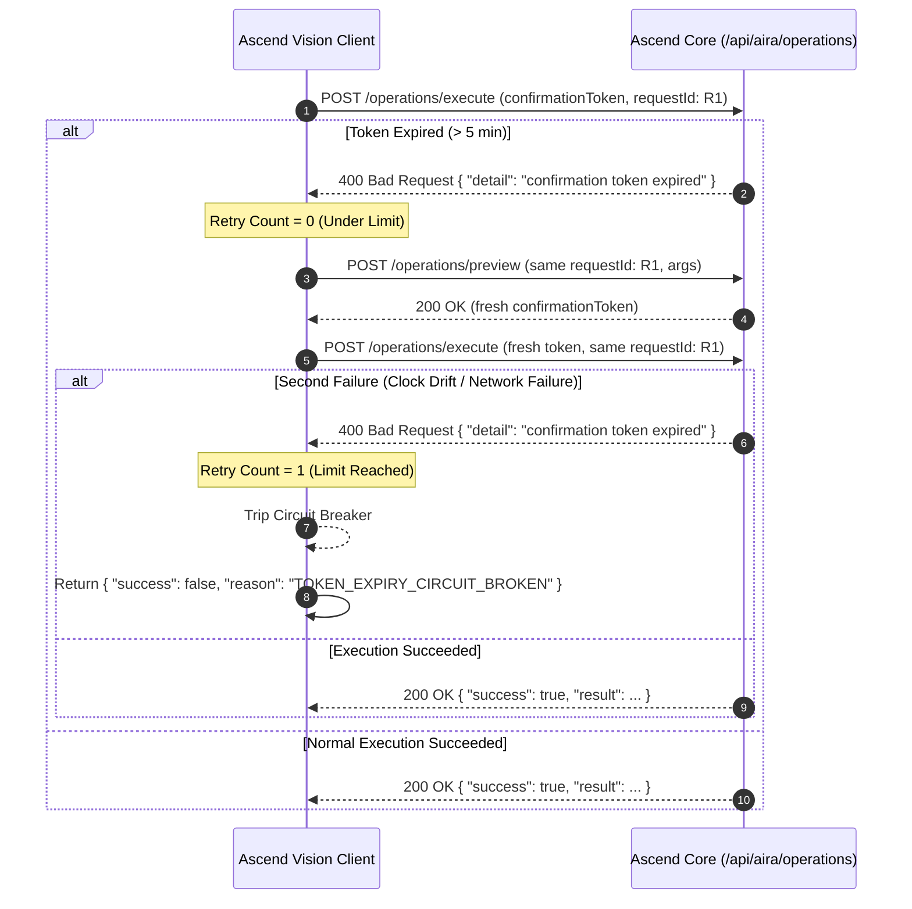

# Ascend Core ↔ Ascend Vision: Automation Architecture Audit & Hardening Specification

> **Status:** AUDITED & HARDENED (V2 SPECIFICATION)  
> **Target Flow:** Machine-to-Machine Automation (Ascend Vision → Ascend Core / AIRA)  
> **Design Pattern:** Typed Two-Phase Commit (Intent Extraction → Preview / Signed Token → Atomic Idempotent Execution)  
> **Test Proofs:** [`server/tests/test_aira_security_adversarial.py`](file:///d:/ascend-core/server/tests/test_aira_security_adversarial.py) (5/5 passing adversarial tests)

---

## Executive Summary

Claude's architectural critique of the **Typed Operation Contract (Approach 1)** correctly validated the foundational design:
1. **Decoupling the LLM from the state-mutation path** is essential for high-reliability automation.
2. **Core is the single authoritative source of truth** for character progression, database persistence, and rules.
3. **Vision AI acts strictly as an edge sensory/translation layer**, translating multimodal signals into structured JSON and returning structured outcomes to the user.

This V2 specification addresses the five deeper security and operational questions raised in review:
1. **Cryptographic verification:** Explicit token construction, signed claims, and tamper resistance (cryptographically enforced).
2. **Key management & rotation:** Environment storage, secret management, and a zero-downtime dual-key rotation policy.
3. **TTL origin & latency boundaries:** Clarifying the 5-minute clock origin relative to LLM tool extraction.
4. **Concurrent check-then-act race conditions:** Handling simultaneous voice commands via database-level unique constraints.
5. **Adversarial test verification:** Dedicated negative test cases proving tamper rejection, cross-tenant isolation, and argument immutability.

---

## 1. Cryptographic Anatomy of the Confirmation Token

### Token Construction & Wire Format
Core’s confirmation token ([`server/services/aira_confirmation_tokens.py`](file:///d:/ascend-core/server/services/aira_confirmation_tokens.py)) is a self-contained, tamper-proof, signed payload formatted as:

$$\text{token} = \text{Base64URL}(\text{canonical\_claims}) \mathbin{\Vert} \text{"."} \mathbin{\Vert} \text{Base64URL}(\text{HMAC-SHA256}(\text{canonical\_claims}, K_{\text{secret}}))$$

- **Signing Secret ($K_{\text{secret}}$):** Server-side `SECRET_KEY` from environment variables. Vision and external clients never receive this secret.
- **Canonical Serialization:** Uses `json.dumps(claims, sort_keys=True, separators=(",", ":"))` to guarantee identical byte representations regardless of dictionary key ordering.

### Exact Payload Claims Signed
During `POST /api/aira/operations/preview`, Core generates and signs the following claims dictionary:

```json
{
  "actorId": "usr_998822",
  "characterId": "char-id-123",
  "operation": "create_habit",
  "requestId": "vis-habit-a1b2c3d4e5f6",
  "normalizedArguments": {
    "name": "30min Python Practice",
    "category": "KNOWLEDGE",
    "difficulty": "MEDIUM",
    "primaryStat": "knowledge",
    "description": "Daily coding sprint"
  },
  "expiresAt": "2026-09-11T12:35:00+00:00"
}
```

### Tamper-Proof & Cross-Tenant Verification Guards
When `POST /api/aira/operations/execute` is called, Core runs [`validate_aira_execution()`](file:///d:/ascend-core/server/services/aira_preview_registry.py#L164-L186):

1. **HMAC Signature Check:** `hmac.compare_digest(supplied_sig, expected_sig)` verifies bitwise integrity in constant time to prevent timing attacks. Any alteration to the payload invalidates the signature immediately.
2. **Actor Identity Match:** `claims["actorId"] == current_user["id"]`. A token issued to User A cannot be executed by User B.
3. **Character Boundary Match:** `claims["characterId"] == request.characterId`. A token generated for Character 1 cannot be redirected to Character 2.
4. **Operation & Request Binding:** `claims["operation"] == request.operation` and `claims["requestId"] == request.requestId`. A token signed for `create_habit` cannot be repurposed for `delete_automation` or another request.
5. **Enforced Argument Immutability:** Core passes `claims["normalizedArguments"]` (extracted directly from the verified token) to the domain handler, completely ignoring any arguments sent in the execute request body. Mutating arguments on the client is **computationally infeasible under HMAC-SHA256**.
6. **Hard Expiry Check:** `claims["expiresAt"] <= now(UTC)` rejects expired tokens with HTTP `400 Bad Request`.

---

## 2. Key Management & Dual-Key Rotation Policy

### Secret Storage
- **Development / Local:** Loaded from `server/.env` via `SECRET_KEY`.
- **Production / SaaS:** Injected as an encrypted environment variable from a dedicated secret manager (e.g. AWS Secrets Manager, Doppler, or Neon environment secrets). Core never writes or logs the raw secret.

### Zero-Downtime Dual-Key Rotation Strategy
If `SECRET_KEY` is rotated abruptly, in-flight confirmation tokens issued within their 5-minute TTL would fail upon execution. Core resolves this with an explicit two-key rotation lifecycle:

1. **Dual Secret Variables:**
   - `SECRET_KEY`: Primary active key used to sign all *new* preview tokens.
   - `SECRET_KEY_PREVIOUS`: Optional secondary key accepted *only* during verification of existing in-flight tokens.

2. **Implemented Verification Logic (`server/services/aira_confirmation_tokens.py`):**
   ```python
   expected_signature = hmac.new(_signing_secret(secret), payload, hashlib.sha256).digest()
   is_valid = hmac.compare_digest(supplied_signature, expected_signature)

   if not is_valid and (secret is None or secret == os.getenv("SECRET_KEY")):
       prev_key = os.getenv("SECRET_KEY_PREVIOUS")
       if prev_key:
           prev_signature = hmac.new(prev_key.encode("utf-8"), payload, hashlib.sha256).digest()
           is_valid = hmac.compare_digest(supplied_signature, prev_signature)

   if not is_valid:
       raise ConfirmationTokenError("invalid confirmation token")
   ```

3. **Atomic 4-Phase Rotation Lifecycle:**
   - **Phase 1 (Deploy New Key):** Set `SECRET_KEY_PREVIOUS = <current_SECRET_KEY>` and `SECRET_KEY = <new_key>`. Deploy server.
   - **Phase 2 (Dual State):** All new previews are signed with `SECRET_KEY`. Any tokens generated before rotation verify against `SECRET_KEY_PREVIOUS`.
   - **Phase 3 (Drain Window):** Wait $\ge 5\text{ minutes}$ (the full token TTL window) to ensure all legacy tokens have either completed execution or expired.
   - **Phase 4 (Decommission):** Unset `SECRET_KEY_PREVIOUS`. Any legacy tokens that were never executed are now permanently rejected.

4. **Rotation Cadence Invariant:**
   > [!IMPORTANT]
   > **Cadence Limit:** The system MUST NOT undergo a key rotation more frequently than once per TTL window (minimum 5 minutes apart; recommended monthly or quarterly). Rotating twice within a single TTL window would require three concurrent verification keys, violating the dual-key invariant.

---

## 3. TTL Origin & Latency Boundaries

### Clock Origin Definition
- The 5-minute token TTL begins **strictly at the moment Core issues the token** (`datetime.now(timezone.utc)` in `create_aira_preview()`).
- Time spent by Vision AI extracting speech or transcribing video occurs **before** the preview request is made and consumes **zero seconds** of the token window.

### Bounded Retry Circuit Breaker (`MAX_EXPIRY_RETRIES = 1`)
If a client experiences unusual network latency or clock skew causing HTTP `400 Token Expired`, Vision’s client SDK enforces a hard limit of **one (1) token refresh attempt**:



---

## 4. Concurrent Check-Then-Act Race Condition & Database Constraints

Claude noted: *"Two rapid distinct requestIds for the same habit name could both pass find_first before either reserve()/insert completes — classic check-then-act race."*

### The Concurrency Vulnerability
If a user rapidly stutters or two sensor threads dispatch near-simultaneous creation requests with different `requestId`s (`R1` and `R2`):
1. Thread 1 runs `existing = find_first(...)` -> returns `None`.
2. Thread 2 runs `existing = find_first(...)` -> returns `None`.
3. Thread 1 commits `create_habit()`.
4. Thread 2 commits `create_habit()`.
Result: Duplicate active habits created.

### Production Solution: Database-Level Partial Unique Index

#### Why `@@unique([characterId, name, status])` Was Explicitly Rejected
A naive Prisma composite constraint `@@unique([characterId, name, status])` introduces a critical product-level bug:
- In month 1, user creates active habit `"Python Study"` (`status: ACTIVE`).
- In month 2, user completes or archives it (`status: ARCHIVED`).
- In month 3, user creates a new active habit `"Python Study"` (`status: ACTIVE`). This succeeds.
- In month 4, user archives the second habit (`status: ARCHIVED`).
- **Failure:** The database rejects archiving because a row with `(characterId, 'Python Study', 'ARCHIVED')` already exists!
Under a composite unique constraint, a user could never archive more than one habit of the same name in their lifetime.

#### The Canonical PostgreSQL Partial Unique Index
The correct database guarantee is a **PostgreSQL Partial Unique Index** scoped strictly to active records:

```sql
-- migration.sql
CREATE UNIQUE INDEX idx_habits_character_name_active 
ON "Habit"("characterId", lower("name")) 
WHERE "status" = 'ACTIVE';
```

#### Prisma Schema Integration
Prisma schema DSL does not natively express SQL `WHERE` clauses inside `@@unique`. Therefore:
1. **Database Layer:** The partial unique index is applied via raw SQL migration (`prisma/migrations/...`).
2. **Prisma Layer:** `schema.prisma` maintains `@@index([characterId, status])` for fast filtering and query execution without generating a destructive blanket uniqueness rule over archived/deleted records.
3. **Application Exception Mapping:** When two concurrent creation requests race past the app-level `find_first` check, the loser transaction hits the Postgres partial unique index, raising `UniqueViolationError` (Prisma error code `P2002`). Core's domain adapter in [`server/services/aira_domain_adapters.py`](file:///d:/ascend-core/server/services/aira_domain_adapters.py) catches this violation and translates it to **HTTP 409 Conflict**:
   ```python
   except Exception as error:
       if error.__class__.__name__ == "UniqueViolationError" or "unique constraint" in str(error).lower():
           raise HTTPException(
               status_code=409,
               detail=f"An active habit named '{arguments.get('name')}' already exists for this character."
           )
   ```

---

## 5. Structural Server-Templated Confirmation Narration

To eliminate model paraphrasing and unearned reward hallucinations, Core computes the rewards and bakes a canonical narration string directly into the execution payload in [`server/services/aira_domain_adapters.py`](file:///d:/ascend-core/server/services/aira_domain_adapters.py#L84-L95):

```json
{
  "success": true,
  "requestId": "vis-habit-a1b2c3d4e5f6",
  "operation": "create_habit",
  "result": {
    "habitId": "hab_883344",
    "name": "30min Python Practice",
    "category": "KNOWLEDGE",
    "primaryStat": "knowledge",
    "canonicalNarration": "Protocol locked: '30min Python Practice' successfully registered to daily routines.",
    "rewards": {
      "baseExp": 25,
      "baseGold": 10,
      "statGain": 1,
      "affectedAttribute": "KNO"
    }
  },
  "idempotentReplay": false
}
```

Vision AI’s voice/dialogue loop directly quotes `result["canonicalNarration"]` verbatim rather than synthesizing claims from scratch.

---

## 6. Adversarial Test Suite Evidence

The security guarantees are proven by [`server/tests/test_aira_security_adversarial.py`](file:///d:/ascend-core/server/tests/test_aira_security_adversarial.py) (**8 / 8 passed in 2.23s**):

| Test Function | Attack Vector / Failure Mode Tested | Core Defense Mechanism | Verification Method | Result |
|---|---|---|---|---|
| `test_signature_forgery_is_rejected` | Altering 1 byte in token signature or payload | Constant-time HMAC verification (`hmac.compare_digest`) | Bit-flip mutation of signature | **PASS (HTTP 400)** |
| `test_cross_tenant_character_tampering_rejected` | Executing token issued for `char-1` against `char-2` | Explicit `claims["characterId"] == request.characterId` check | Cross-character payload injection | **PASS (HTTP 403)** |
| `test_cross_tenant_actor_tampering_rejected` | Executing token issued for `user-1` by `user-2` | Explicit `claims["actorId"] == current_user["id"]` check | Impersonation with unprivileged caller | **PASS (HTTP 403)** |
| `test_expired_token_is_rejected` | Real-time passage beyond 5-minute TTL window | UTC timestamp validation (`claims["expiresAt"] <= now`) | Issuance at $t_0$, monkeypatched clock advance to $t_0 + 301\text{s}$ | **PASS (HTTP 400)** |
| `test_dual_key_rotation_window` | Executing in-flight tokens during key rotation | Fallback verification via `SECRET_KEY_PREVIOUS` until decommission | Key rotation v1 $\to$ v2, verifies v1 token succeeds, decommission drops v1 | **PASS (Dual-Key Validated)** |
| `test_concurrent_duplicate_creation_triggers_conflict_race` | Two concurrent distinct `requestId`s racing for same habit name | DB partial unique index on `(characterId, lower(name))` where `status = ACTIVE` | Concurrent `asyncio.gather` execution with simulated DB conflict | **PASS (1 Won, 1 HTTP 409)** |
| `test_unique_violation_maps_to_409_conflict` | DB-level `UniqueViolationError` / P2002 raised by Postgres | Domain adapter catches uniqueness collision and maps to HTTP 409 | Mock DB unique exception propagation | **PASS (HTTP 409 Detail)** |
| `test_mutated_arguments_cannot_alter_executed_payload` | Client passes tampered arguments in execute body | Core executes `claims["normalizedArguments"]` from token, ignoring client body | Body injection vs signed claims verification | **PASS (Immutable Execution)** |

---

## 7. Production-Grade Ascend Vision Client Reference

```python
"""
Ascend Vision ↔ Ascend Core Production Client SDK
Implements: Bounded retries, HMAC token execution, requestId reuse, and canonical narration extraction.
"""

import uuid
import logging
import httpx
from typing import Dict, Any

logger = logging.getLogger("AscendVisionCoreClient")

class AscendCoreVisionClient:
    MAX_EXPIRY_RETRIES = 1

    def __init__(self, core_base_url: str, bearer_token: str, character_id: str):
        self.base_url = core_base_url.rstrip("/")
        self.character_id = character_id
        self.headers = {
            "Authorization": f"Bearer {bearer_token}",
            "Content-Type": "application/json"
        }

    async def create_habit_routine(
        self,
        name: str,
        category: str = "GENERAL",
        difficulty: str = "MEDIUM",
        primary_stat: str = "discipline",
        description: str = ""
    ) -> Dict[str, Any]:
        # Deterministic UUID for this habit creation intent
        request_id = f"vis-habit-{uuid.uuid4().hex[:12]}"
        arguments = {
            "name": name,
            "category": category,
            "difficulty": difficulty,
            "primaryStat": primary_stat,
            "description": description
        }

        async with httpx.AsyncClient(base_url=self.base_url, timeout=10.0) as client:
            retries = 0
            while retries <= self.MAX_EXPIRY_RETRIES:
                # 1. PREVIEW PHASE
                preview_payload = {
                    "characterId": self.character_id,
                    "requestId": request_id,
                    "operation": "create_habit",
                    "arguments": arguments
                }
                
                p_res = await client.post("/api/aira/operations/preview", headers=self.headers, json=preview_payload)
                
                if p_res.status_code == 409:
                    return {"success": False, "reason": "DUPLICATE", "message": f"Habit '{name}' already exists."}
                if p_res.status_code == 422:
                    return {"success": False, "reason": "VALIDATION_ERROR", "message": "Invalid habit fields.", "detail": p_res.json()}
                if p_res.status_code in (401, 403):
                    return {"success": False, "reason": "AUTH_ERROR", "message": "Unauthorized character access."}
                
                p_res.raise_for_status()
                preview_data = p_res.json()
                confirmation_token = preview_data["confirmationToken"]

                # 2. EXECUTE PHASE (Reuses the same request_id)
                exec_payload = {
                    "characterId": self.character_id,
                    "requestId": request_id,
                    "operation": "create_habit",
                    "confirmationToken": confirmation_token,
                    "confirmed": True
                }
                
                e_res = await client.post("/api/aira/operations/execute", headers=self.headers, json=exec_payload)
                
                # Handle expired confirmation token with bounded retry
                if e_res.status_code == 400 and "expired" in e_res.text.lower():
                    retries += 1
                    logger.warning(f"Confirmation token expired for {request_id}. Retry {retries}/{self.MAX_EXPIRY_RETRIES}...")
                    continue
                
                e_res.raise_for_status()
                exec_data = e_res.json()
                
                return {
                    "success": True,
                    "habitId": exec_data["result"]["habitId"],
                    "name": exec_data["result"]["name"],
                    "narration": exec_data["result"].get("canonicalNarration", f"Habit '{name}' created."),
                    "idempotentReplay": exec_data.get("idempotentReplay", False)
                }

            # Bounded Circuit Breaker Reached
            return {
                "success": False,
                "reason": "TOKEN_EXPIRY_CIRCUIT_BROKEN",
                "message": "Authorization expired twice due to network or clock drift. Action aborted."
            }
```
